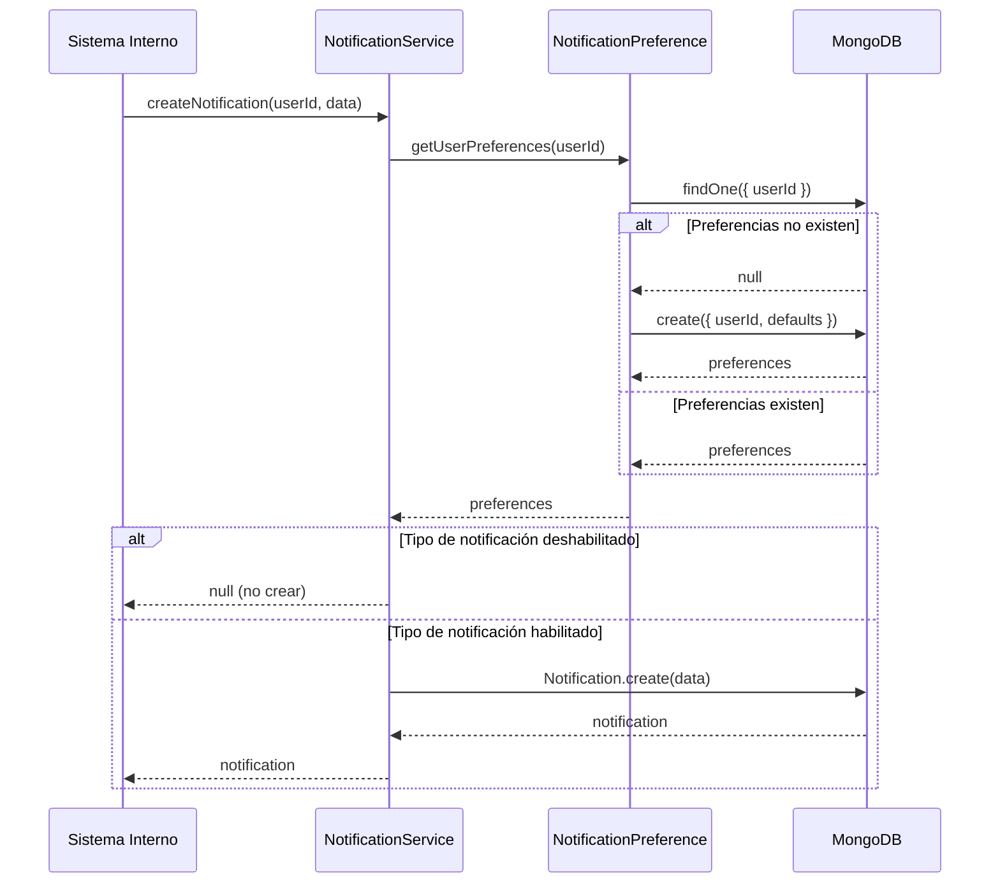
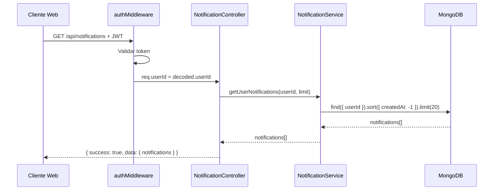
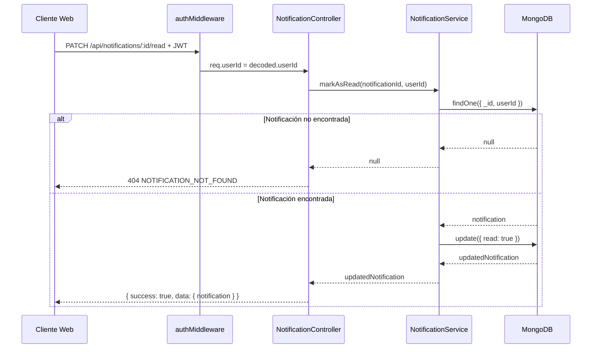

# Design Document: Notificaciones y Alertas Inteligentes - Fase 1 (Backend)

## Overview

2. **Preferencias de Usuario**: Permitir a los usuarios controlar qué tipos de notificaciones reciben
3. **Cumplimiento Legal**: Respetar la Ley 1581 de 2012 mediante autenticación obligatoria y validación de userId
4. **Escalabilidad**: Diseño optimizado con índices MongoDB para consultas eficientes
5. **Extensibilidad**: Preparar la base para Cron Jobs (Fase 2) y UI (Fase 3)

### Alcance de la Fase 1

Esta fase implementa exclusivamente el backend:
- Modelos de datos Mongoose (Notification, NotificationPreference)
- Servicio de notificaciones (notificationService.ts)
- Controlador HTTP (notificationController.ts)
- Rutas API autenticadas (notificationRoutes.ts)
- Integración con Express server

**Fuera de alcance**: Cron jobs automáticos, interfaz de usuario, notificaciones push

## Architecture

### Arquitectura General

El sistema sigue la arquitectura de capas establecida en FinanceFlow AI:

```
┌─────────────────────────────────────────────────────────────┐
│                     Express Application                      │
│                      (apps/api/src/)                         │
└─────────────────────────────────────────────────────────────┘
                              │
                              ▼
┌─────────────────────────────────────────────────────────────┐
│                    Notification Routes                       │
│              /api/notifications (GET, PATCH)                 │
│         /api/notifications/preferences (GET, POST)           │
│                   + authMiddleware                           │
└─────────────────────────────────────────────────────────────┘
                              │
                              ▼
┌─────────────────────────────────────────────────────────────┐
│                  Notification Controller                     │
│         - getNotifications()                                 │
│         - markNotificationAsRead()                           │
│         - getPreferences()                                   │
│         - updatePreferences()                                │
└─────────────────────────────────────────────────────────────┘
                              │
                              ▼
┌─────────────────────────────────────────────────────────────┐
│                  Notification Service                        │
│         - createNotification()                               │
│         - getUserNotifications()                             │
│         - markAsRead()                                       │
│         - getUserPreferences()                               │
│         - updateUserPreferences()                            │
└─────────────────────────────────────────────────────────────┘
                              │
                              ▼
┌─────────────────────────────────────────────────────────────┐
│                    MongoDB Atlas                             │
│         - notifications collection                           │
│         - notificationPreferences collection                 │
└─────────────────────────────────────────────────────────────┘
```

### Flujo de Datos

#### Flujo 1: Crear Notificación (Interno)



#### Flujo 2: Obtener Notificaciones (API)



#### Flujo 3: Marcar como Leída (API)



### Patrones de Diseño

1. **Service Layer Pattern**: Lógica de negocio encapsulada en notificationService.ts
2. **Repository Pattern**: Mongoose models actúan como repositorios
3. **Middleware Pattern**: authMiddleware para autenticación JWT
4. **Error Handling Pattern**: Códigos de error consistentes en todas las respuestas

## Components and Interfaces

### 1. Notification Model (apps/api/src/models/Notification.ts)

```typescript
import mongoose, { Schema, Document } from 'mongoose';

export type NotificationType = 'subscription' | 'plan_alert' | 'insight' | 'weekly_digest';

export interface INotification extends Document {
  userId: mongoose.Types.ObjectId;
  type: NotificationType;
  title: string;
  message: string;
  read: boolean;
  actionUrl?: string;
  createdAt: Date;
  updatedAt: Date;
}

const NotificationSchema = new Schema<INotification>(
  {
    userId: {
      type: Schema.Types.ObjectId,
      ref: 'User',
      required: true,
      index: true
    },
    type: {
      type: String,
      enum: ['subscription', 'plan_alert', 'insight', 'weekly_digest'],
      required: true
    },
    title: {
      type: String,
      required: true,
      trim: true
    },
    message: {
      type: String,
      required: true,
      trim: true
    },
    read: {
      type: Boolean,
      default: false,
      index: true
    },
    actionUrl: {
      type: String,
      trim: true
    }
  },
  {
    timestamps: true,
    collection: 'notifications'
  }
);

// Índice compuesto para consultas eficientes (userId + ordenamiento por fecha)
NotificationSchema.index({ userId: 1, createdAt: -1 });

export const Notification = mongoose.model<INotification>('Notification', NotificationSchema);
```

### 2. NotificationPreference Model (apps/api/src/models/NotificationPreference.ts)

```typescript
import mongoose, { Schema, Document } from 'mongoose';

export interface INotificationPreference extends Document {
  userId: mongoose.Types.ObjectId;
  subscriptionAlerts: boolean;
  planAlerts: boolean;
  weeklyDigest: boolean;
  pushEnabled: boolean;
  createdAt: Date;
  updatedAt: Date;
}

const NotificationPreferenceSchema = new Schema<INotificationPreference>(
  {
    userId: {
      type: Schema.Types.ObjectId,
      ref: 'User',
      required: true,
      unique: true,
      index: true
    },
    subscriptionAlerts: {
      type: Boolean,
      default: true
    },
    planAlerts: {
      type: Boolean,
      default: true
    },
    weeklyDigest: {
      type: Boolean,
      default: true
    },
    pushEnabled: {
      type: Boolean,
      default: false
    }
  },
  {
    timestamps: true,
    collection: 'notificationPreferences'
  }
);

export const NotificationPreference = mongoose.model<INotificationPreference>(
  'NotificationPreference',
  NotificationPreferenceSchema
);
```

### 3. Notification Service (apps/api/src/services/notificationService.ts)

```typescript
import mongoose from 'mongoose';
import { Notification, INotification, NotificationType } from '../models/Notification';
import { NotificationPreference, INotificationPreference } from '../models/NotificationPreference';

export interface CreateNotificationData {
  userId: string;
  type: NotificationType;
  title: string;
  message: string;
  actionUrl?: string;
}

export interface UpdatePreferencesData {
  subscriptionAlerts?: boolean;
  planAlerts?: boolean;
  weeklyDigest?: boolean;
  pushEnabled?: boolean;
}

/**
 * Crear notificación respetando preferencias del usuario
 * @returns notification si se creó, null si el usuario tiene deshabilitado ese tipo
 */
export async function createNotification(
  data: CreateNotificationData
): Promise<INotification | null> {
  // Validar userId
  if (!mongoose.Types.ObjectId.isValid(data.userId)) {
    throw new Error('Invalid userId: must be a valid MongoDB ObjectId');
  }

  // Validar campos requeridos
  if (!data.title || data.title.trim() === '') {
    throw new Error('Title is required and cannot be empty');
  }
  if (!data.message || data.message.trim() === '') {
    throw new Error('Message is required and cannot be empty');
  }

  // Obtener preferencias del usuario
  const preferences = await getUserPreferences(data.userId);

  // Verificar si el tipo de notificación está habilitado
  const preferenceMap: Record<NotificationType, keyof INotificationPreference> = {
    subscription: 'subscriptionAlerts',
    plan_alert: 'planAlerts',
    insight: 'weeklyDigest', // insights usan weeklyDigest preference
    weekly_digest: 'weeklyDigest'
  };

  const preferenceKey = preferenceMap[data.type];
  if (!preferences[preferenceKey]) {
    return null; // Usuario tiene deshabilitado este tipo de notificación
  }

  // Crear notificación
  const notification = new Notification({
    userId: new mongoose.Types.ObjectId(data.userId),
    type: data.type,
    title: data.title,
    message: data.message,
    actionUrl: data.actionUrl,
    read: false
  });

  await notification.save();
  return notification;
}

/**
 * Obtener notificaciones del usuario
 */
export async function getUserNotifications(
  userId: string,
  limit: number = 20
): Promise<INotification[]> {
  // Validar userId
  if (!mongoose.Types.ObjectId.isValid(userId)) {
    throw new Error('Invalid userId: must be a valid MongoDB ObjectId');
  }

  const notifications = await Notification.find({
    userId: new mongoose.Types.ObjectId(userId)
  })
    .sort({ createdAt: -1 })
    .limit(limit)
    .lean();

  return notifications;
}

/**
 * Marcar notificación como leída
 */
export async function markAsRead(
  notificationId: string,
  userId: string
): Promise<INotification | null> {
  // Validar IDs
  if (!mongoose.Types.ObjectId.isValid(notificationId)) {
    throw new Error('Invalid notificationId: must be a valid MongoDB ObjectId');
  }
  if (!mongoose.Types.ObjectId.isValid(userId)) {
    throw new Error('Invalid userId: must be a valid MongoDB ObjectId');
  }

  // Buscar notificación que pertenezca al usuario
  const notification = await Notification.findOne({
    _id: new mongoose.Types.ObjectId(notificationId),
    userId: new mongoose.Types.ObjectId(userId)
  });

  if (!notification) {
    return null; // No encontrada o no pertenece al usuario
  }

  // Actualizar campo read
  notification.read = true;
  await notification.save();

  return notification;
}

/**
 * Obtener preferencias del usuario (crea defaults si no existen)
 */
export async function getUserPreferences(
  userId: string
): Promise<INotificationPreference> {
  // Validar userId
  if (!mongoose.Types.ObjectId.isValid(userId)) {
    throw new Error('Invalid userId: must be a valid MongoDB ObjectId');
  }

  let preferences = await NotificationPreference.findOne({
    userId: new mongoose.Types.ObjectId(userId)
  });

  // Si no existen, crear con valores por defecto
  if (!preferences) {
    preferences = new NotificationPreference({
      userId: new mongoose.Types.ObjectId(userId),
      subscriptionAlerts: true,
      planAlerts: true,
      weeklyDigest: true,
      pushEnabled: false
    });
    await preferences.save();
  }

  return preferences;
}

/**
 * Actualizar preferencias del usuario
 */
export async function updateUserPreferences(
  userId: string,
  data: UpdatePreferencesData
): Promise<INotificationPreference> {
  // Validar userId
  if (!mongoose.Types.ObjectId.isValid(userId)) {
    throw new Error('Invalid userId: must be a valid MongoDB ObjectId');
  }

  // Validar que los campos sean booleanos
  const booleanFields: (keyof UpdatePreferencesData)[] = [
    'subscriptionAlerts',
    'planAlerts',
    'weeklyDigest',
    'pushEnabled'
  ];

  for (const field of booleanFields) {
    if (data[field] !== undefined && typeof data[field] !== 'boolean') {
      throw new Error(`${field} must be a boolean value`);
    }
  }

  // Usar findOneAndUpdate con upsert para crear o actualizar
  const preferences = await NotificationPreference.findOneAndUpdate(
    { userId: new mongoose.Types.ObjectId(userId) },
    { $set: data },
    { new: true, upsert: true, setDefaultsOnInsert: true }
  );

  return preferences!;
}
```

### 4. Notification Controller (apps/api/src/controllers/notificationController.ts)

```typescript
import { Request, Response } from 'express';
import {
  getUserNotifications,
  markAsRead,
  getUserPreferences,
  updateUserPreferences,
  UpdatePreferencesData
} from '../services/notificationService';

/**
 * GET /api/notifications
 * Obtener notificaciones del usuario autenticado
 */
export async function getNotifications(req: Request, res: Response): Promise<void> {
  try {
    const userId = req.userId;

    if (!userId) {
      res.status(401).json({
        success: false,
        error: {
          code: 'UNAUTHORIZED',
          message: 'Usuario no autenticado'
        }
      });
      return;
    }

    const notifications = await getUserNotifications(userId);

    res.status(200).json({
      success: true,
      data: {
        notifications
      }
    });
  } catch (error) {
    console.error('Error al obtener notificaciones:', error);

    // Error de validación
    if (error instanceof Error && error.message.includes('Invalid')) {
      res.status(400).json({
        success: false,
        error: {
          code: 'VALIDATION_ERROR',
          message: error.message
        }
      });
      return;
    }

    res.status(500).json({
      success: false,
      error: {
        code: 'INTERNAL_SERVER_ERROR',
        message: 'Error al obtener notificaciones'
      }
    });
  }
}

/**
 * PATCH /api/notifications/:id/read
 * Marcar notificación como leída
 */
export async function markNotificationAsRead(req: Request, res: Response): Promise<void> {
  try {
    const notificationId = req.params.id;
    const userId = req.userId;

    if (!userId) {
      res.status(401).json({
        success: false,
        error: {
          code: 'UNAUTHORIZED',
          message: 'Usuario no autenticado'
        }
      });
      return;
    }

    const notification = await markAsRead(notificationId, userId);

    if (!notification) {
      res.status(404).json({
        success: false,
        error: {
          code: 'NOTIFICATION_NOT_FOUND',
          message: 'Notificación no encontrada o no pertenece al usuario'
        }
      });
      return;
    }

    res.status(200).json({
      success: true,
      data: {
        notification
      }
    });
  } catch (error) {
    console.error('Error al marcar notificación como leída:', error);

    // Error de validación
    if (error instanceof Error && error.message.includes('Invalid')) {
      res.status(400).json({
        success: false,
        error: {
          code: 'VALIDATION_ERROR',
          message: error.message
        }
      });
      return;
    }

    res.status(500).json({
      success: false,
      error: {
        code: 'INTERNAL_SERVER_ERROR',
        message: 'Error al marcar notificación como leída'
      }
    });
  }
}

/**
 * GET /api/notifications/preferences
 * Obtener preferencias de notificación del usuario
 */
export async function getPreferences(req: Request, res: Response): Promise<void> {
  try {
    const userId = req.userId;

    if (!userId) {
      res.status(401).json({
        success: false,
        error: {
          code: 'UNAUTHORIZED',
          message: 'Usuario no autenticado'
        }
      });
      return;
    }

    const preferences = await getUserPreferences(userId);

    res.status(200).json({
      success: true,
      data: {
        preferences
      }
    });
  } catch (error) {
    console.error('Error al obtener preferencias:', error);

    res.status(500).json({
      success: false,
      error: {
        code: 'INTERNAL_SERVER_ERROR',
        message: 'Error al obtener preferencias'
      }
    });
  }
}

/**
 * POST /api/notifications/preferences
 * Actualizar preferencias de notificación del usuario
 */
export async function updatePreferences(req: Request, res: Response): Promise<void> {
  try {
    const userId = req.userId;

    if (!userId) {
      res.status(401).json({
        success: false,
        error: {
          code: 'UNAUTHORIZED',
          message: 'Usuario no autenticado'
        }
      });
      return;
    }

    const data: UpdatePreferencesData = req.body;

    const preferences = await updateUserPreferences(userId, data);

    res.status(200).json({
      success: true,
      data: {
        preferences
      }
    });
  } catch (error) {
    console.error('Error al actualizar preferencias:', error);

    // Error de validación
    if (error instanceof Error && (error.message.includes('Invalid') || error.message.includes('must be'))) {
      res.status(400).json({
        success: false,
        error: {
          code: 'VALIDATION_ERROR',
          message: error.message
        }
      });
      return;
    }

    res.status(500).json({
      success: false,
      error: {
        code: 'INTERNAL_SERVER_ERROR',
        message: 'Error al actualizar preferencias'
      }
    });
  }
}
```

### 5. Notification Routes (apps/api/src/routes/notificationRoutes.ts)

```typescript
import { Router } from 'express';
import { authenticateToken } from '../middleware/authMiddleware';
import {
  getNotifications,
  markNotificationAsRead,
  getPreferences,
  updatePreferences
} from '../controllers/notificationController';

const router = Router();

// Todas las rutas requieren autenticación
router.use(authenticateToken);

// GET /api/notifications - Obtener notificaciones del usuario
router.get('/', getNotifications);

// PATCH /api/notifications/:id/read - Marcar notificación como leída
router.patch('/:id/read', markNotificationAsRead);

// GET /api/notifications/preferences - Obtener preferencias
router.get('/preferences', getPreferences);

// POST /api/notifications/preferences - Actualizar preferencias
router.post('/preferences', updatePreferences);

export default router;
```

### 6. Server Integration (apps/api/src/server.ts)

Agregar las siguientes líneas al archivo server.ts existente:

```typescript
// Importar rutas de notificaciones
import notificationRoutes from './routes/notificationRoutes';

// Montar rutas (después de las rutas existentes)
app.use('/api/notifications', notificationRoutes);
```

## Data Models

### Notification Document

```typescript
{
  _id: ObjectId,
  userId: ObjectId,              // Referencia a User
  type: string,                  // 'subscription' | 'plan_alert' | 'insight' | 'weekly_digest'
  title: string,                 // Título de la notificación
  message: string,               // Mensaje descriptivo
  read: boolean,                 // Estado de lectura (default: false)
  actionUrl?: string,            // URL opcional para acción (ej: /plans/123)
  createdAt: Date,               // Timestamp de creación (auto)
  updatedAt: Date                // Timestamp de actualización (auto)
}
```

**Índices**:
- `{ userId: 1 }` - Consultas por usuario
- `{ userId: 1, createdAt: -1 }` - Consultas ordenadas por fecha
- `{ read: 1 }` - Filtrado de no leídas

**Ejemplo**:
```json
{
  "_id": "507f1f77bcf86cd799439011",
  "userId": "507f191e810c19729de860ea",
  "type": "subscription",
  "title": "Nueva suscripción detectada",
  "message": "Hemos detectado un cargo recurrente de Netflix por $45,000 COP mensual",
  "read": false,
  "actionUrl": "/subscriptions",
  "createdAt": "2024-01-15T10:30:00.000Z",
  "updatedAt": "2024-01-15T10:30:00.000Z"
}
```

### NotificationPreference Document

```typescript
{
  _id: ObjectId,
  userId: ObjectId,              // Referencia a User (unique)
  subscriptionAlerts: boolean,   // Alertas de suscripciones (default: true)
  planAlerts: boolean,           // Alertas de planes de ahorro (default: true)
  weeklyDigest: boolean,         // Resumen semanal (default: true)
  pushEnabled: boolean,          // Push notifications (default: false)
  createdAt: Date,               // Timestamp de creación (auto)
  updatedAt: Date                // Timestamp de actualización (auto)
}
```

**Índices**:
- `{ userId: 1 }` - Unique index para un documento por usuario

**Ejemplo**:
```json
{
  "_id": "507f1f77bcf86cd799439012",
  "userId": "507f191e810c19729de860ea",
  "subscriptionAlerts": true,
  "planAlerts": true,
  "weeklyDigest": false,
  "pushEnabled": false,
  "createdAt": "2024-01-10T08:00:00.000Z",
  "updatedAt": "2024-01-15T14:20:00.000Z"
}
```

### Relaciones

```
User (1) ──────< (N) Notification
  │
  │
  └──────< (1) NotificationPreference
```

- Un usuario puede tener múltiples notificaciones
- Un usuario tiene exactamente un documento de preferencias (unique constraint)


## Correctness Properties

*A property is a characteristic or behavior that should hold true across all valid executions of a system—essentially, a formal statement about what the system should do. Properties serve as the bridge between human-readable specifications and machine-verifiable correctness guarantees.*

### Property Reflection

Después de analizar todos los acceptance criteria, identifiqué las siguientes redundancias:

**Redundancias identificadas**:
1. Criterios 3.3, 3.4, 3.5 pueden combinarse en una sola propiedad sobre filtrado por preferencias
2. Criterios 3.7, 4.7, 6.4, 7.1 son todos sobre validación de ObjectId - se pueden combinar
3. Criterios 9.4, 10.6, 11.4, 12.7 son todos sobre manejo de errores 500 - se pueden combinar
4. Criterios 1.2, 1.3, 1.4, 16.1, 16.2, 16.3 son sobre índices - se verifican en ejemplos, no propiedades
5. Criterios sobre timestamps (1.7, 2.4, 7.7) pueden combinarse en una propiedad
6. Criterios sobre autenticación (9.1, 10.2, 11.1, 12.1) son el mismo patrón

**Propiedades consolidadas**:
- Validación de ObjectId: Una propiedad que valida todos los IDs
- Filtrado por preferencias: Una propiedad que cubre todos los tipos de notificación
- Manejo de errores: Una propiedad que verifica códigos de error consistentes
- Timestamps automáticos: Una propiedad que verifica createdAt/updatedAt
- Extracción de userId: Una propiedad que verifica autenticación en todos los endpoints

### Property 1: Notification Schema Validation

*For any* notification creation attempt, the system should validate that all required fields (userId, type, title, message) are present and have correct types, and should reject invalid enum values for the type field.

**Validates: Requirements 1.1, 1.5, 3.8, 15.2, 15.3**

### Property 2: ObjectId Validation

*For any* service method that receives userId or notificationId as parameter, the system should validate that the ID is a valid MongoDB ObjectId format and throw a descriptive error if invalid.

**Validates: Requirements 3.7, 4.7, 5.1, 6.4, 7.1, 15.1**

### Property 3: Automatic Timestamps

*For any* document creation or update in Notification or NotificationPreference collections, the system should automatically set createdAt on creation and update updatedAt on modification.

**Validates: Requirements 1.7, 2.4, 7.7**

### Property 4: Preference-Based Notification Filtering

*For any* notification creation request, if the user's preference for that notification type is disabled (subscriptionAlerts=false for 'subscription', planAlerts=false for 'plan_alert', weeklyDigest=false for 'insight' or 'weekly_digest'), the system should not create the notification and return null.

**Validates: Requirements 3.3, 3.4, 3.5**

### Property 5: Default Preferences Creation

*For any* user without existing notification preferences, when preferences are queried or a notification is created, the system should automatically create default preferences with all notification types enabled (subscriptionAlerts=true, planAlerts=true, weeklyDigest=true, pushEnabled=false).

**Validates: Requirements 3.2, 6.2, 6.5**

### Property 6: Notification Creation with Valid Preferences

*For any* notification creation request where the user's preference allows that notification type, the system should successfully create and save the notification document in MongoDB with all provided fields.

**Validates: Requirements 3.6**

### Property 7: User-Specific Notification Retrieval

*For any* getUserNotifications request, the system should return only notifications belonging to the specified userId, sorted by createdAt in descending order (newest first), and limited to the specified limit (default 20).

**Validates: Requirements 4.1, 4.2, 4.3, 4.4, 4.5**

### Property 8: Empty Notification Array for New Users

*For any* user with no notifications, getUserNotifications should return an empty array rather than null or throwing an error.

**Validates: Requirements 4.6**

### Property 9: Authorization for Mark as Read

*For any* markAsRead request, the system should only update notifications that match both the notificationId AND the userId, ensuring users cannot mark other users' notifications as read.

**Validates: Requirements 5.2, 13.2**

### Property 10: Mark as Read Returns Null for Not Found

*For any* markAsRead request where the notification doesn't exist or doesn't belong to the user, the system should return null without throwing an error.

**Validates: Requirements 5.3**

### Property 11: Mark as Read Updates and Persists

*For any* valid markAsRead request, the system should update the read field to true, persist the change to MongoDB, and return the updated notification document.

**Validates: Requirements 5.4, 5.5, 5.6**

### Property 12: Mark as Read Idempotency

*For any* notification that is already marked as read, calling markAsRead again should succeed without error and return the notification with read=true.

**Validates: Requirements 5.7**

### Property 13: Preference Document Structure

*For any* getUserPreferences or updateUserPreferences response, the returned preference document should contain all required fields: subscriptionAlerts, planAlerts, weeklyDigest, pushEnabled (all boolean values).

**Validates: Requirements 6.3**

### Property 14: Boolean Validation for Preferences

*For any* updateUserPreferences request, if any preference field is provided with a non-boolean value, the system should throw a validation error with a descriptive message.

**Validates: Requirements 7.2**

### Property 15: Upsert Behavior for Preferences

*For any* updateUserPreferences request, the system should use findOneAndUpdate with upsert option to either update existing preferences or create new ones with provided values and defaults for omitted fields.

**Validates: Requirements 7.3, 7.6**

### Property 16: Partial Updates for Preferences

*For any* updateUserPreferences request, the system should only update the preference fields provided in the request data, leaving other fields unchanged.

**Validates: Requirements 7.4**

### Property 17: Updated Preference Return Value

*For any* successful updateUserPreferences request, the system should return the updated preference document reflecting all changes.

**Validates: Requirements 7.5**

### Property 18: Unique Preference per User

*For any* user, attempting to create a second NotificationPreference document should fail due to the unique index on userId, ensuring one preference document per user.

**Validates: Requirements 2.2**

### Property 19: Default Preference Values

*For any* new NotificationPreference document created without explicit values, the system should set subscriptionAlerts=true, planAlerts=true, weeklyDigest=true, pushEnabled=false.

**Validates: Requirements 2.5**

### Property 20: Authentication Required for All Endpoints

*For any* request to notification endpoints (/api/notifications, /api/notifications/:id/read, /api/notifications/preferences) without a valid JWT token, the system should return HTTP 401 with error code 'NO_TOKEN' or 'INVALID_TOKEN'.

**Validates: Requirements 8.5, 13.1**

### Property 21: UserId Extraction from JWT

*For any* authenticated request to notification endpoints, the controller should extract userId from req.userId (set by authMiddleware) and use it for all service calls.

**Validates: Requirements 9.1, 10.2, 11.1, 12.1**

### Property 22: Successful Response Format

*For any* successful API response from notification endpoints, the response should have HTTP 200 status and JSON body with structure: { success: true, data: { [resource]: object/array } }.

**Validates: Requirements 9.3, 10.4, 11.3, 12.5**

### Property 23: Validation Error Response Format

*For any* validation error (invalid ObjectId, missing fields, invalid types), the controller should return HTTP 400 with JSON body: { success: false, error: { code: 'VALIDATION_ERROR', message: string } }.

**Validates: Requirements 9.5, 12.6**

### Property 24: Not Found Error Response

*For any* markAsRead request where the notification is not found or doesn't belong to the user, the controller should return HTTP 404 with error code 'NOTIFICATION_NOT_FOUND'.

**Validates: Requirements 10.5**

### Property 25: Internal Server Error Response Format

*For any* unexpected error during request processing, the controller should return HTTP 500 with JSON body: { success: false, error: { code: 'INTERNAL_SERVER_ERROR', message: string } }.

**Validates: Requirements 9.4, 10.6, 11.4, 12.7, 15.5**

### Property 26: Error Code Consistency

*For all* error responses from the notification system, the response should include an error code field for client-side error handling.

**Validates: Requirements 15.6**

### Property 27: No Internal Details in Errors

*For all* error responses, the system should not expose internal implementation details (database connection strings, stack traces, internal paths) in the API response message.

**Validates: Requirements 15.7**

### Property 28: Data Isolation Between Users

*For any* user, API responses should never contain notification or preference data belonging to other users, ensuring complete data isolation.

**Validates: Requirements 13.3, 13.4**

### Property 29: Notification Query Performance

*For any* getUserNotifications request, the system should limit results to the specified limit (default 20) to prevent performance degradation with large datasets.

**Validates: Requirements 16.4**

## Error Handling

### Error Categories

El sistema maneja cuatro categorías principales de errores:

#### 1. Authentication Errors (HTTP 401)

**Códigos de error**:
- `NO_TOKEN`: Token JWT no proporcionado en el header Authorization
- `INVALID_TOKEN`: Token JWT inválido o malformado
- `TOKEN_EXPIRED`: Token JWT expirado
- `UNAUTHORIZED`: Usuario no autenticado (req.userId no disponible)

**Manejo**: Implementado por `authMiddleware.ts`, retorna 401 antes de llegar al controller

**Ejemplo de respuesta**:
```json
{
  "success": false,
  "error": {
    "code": "NO_TOKEN",
    "message": "Token de autenticación no proporcionado"
  }
}
```

#### 2. Validation Errors (HTTP 400)

**Códigos de error**:
- `VALIDATION_ERROR`: Datos de entrada inválidos

**Causas comunes**:
- ObjectId inválido (userId, notificationId)
- Campos requeridos faltantes (title, message)
- Tipos de datos incorrectos (preference fields no booleanos)
- Enum inválido (notification type no permitido)

**Manejo**: Service lanza Error con mensaje descriptivo, controller captura y retorna 400

**Ejemplo de respuesta**:
```json
{
  "success": false,
  "error": {
    "code": "VALIDATION_ERROR",
    "message": "Invalid userId: must be a valid MongoDB ObjectId"
  }
}
```

#### 3. Not Found Errors (HTTP 404)

**Códigos de error**:
- `NOTIFICATION_NOT_FOUND`: Notificación no existe o no pertenece al usuario

**Manejo**: Service retorna null, controller verifica y retorna 404

**Ejemplo de respuesta**:
```json
{
  "success": false,
  "error": {
    "code": "NOTIFICATION_NOT_FOUND",
    "message": "Notificación no encontrada o no pertenece al usuario"
  }
}
```

#### 4. Internal Server Errors (HTTP 500)

**Códigos de error**:
- `INTERNAL_SERVER_ERROR`: Error inesperado del servidor

**Causas comunes**:
- Fallo de conexión a MongoDB
- Error de Mongoose no anticipado
- Excepción no capturada en service

**Manejo**: Controller captura cualquier error no manejado y retorna 500

**Ejemplo de respuesta**:
```json
{
  "success": false,
  "error": {
    "code": "INTERNAL_SERVER_ERROR",
    "message": "Error al obtener notificaciones"
  }
}
```

### Error Handling Flow

```typescript
// Service Layer: Lanza errores descriptivos
if (!mongoose.Types.ObjectId.isValid(userId)) {
  throw new Error('Invalid userId: must be a valid MongoDB ObjectId');
}

// Controller Layer: Captura y clasifica errores
try {
  const result = await service.method();
  res.status(200).json({ success: true, data: result });
} catch (error) {
  console.error('Error:', error); // Log para debugging
  
  // Clasificar error
  if (error instanceof Error && error.message.includes('Invalid')) {
    res.status(400).json({
      success: false,
      error: { code: 'VALIDATION_ERROR', message: error.message }
    });
    return;
  }
  
  // Error genérico
  res.status(500).json({
    success: false,
    error: { code: 'INTERNAL_SERVER_ERROR', message: 'Error message' }
  });
}
```

### Security Considerations

1. **No exponer detalles internos**: Los mensajes de error nunca incluyen stack traces, rutas de archivos o detalles de MongoDB
2. **Logging seguro**: Los errores se loguean con `console.error` para debugging, pero no se envían al cliente
3. **Validación de autorización**: Todos los métodos validan que userId del JWT coincida con el recurso solicitado

## Testing Strategy

### Dual Testing Approach

El sistema de notificaciones requiere dos tipos de testing complementarios:

#### 1. Unit Tests (Vitest)

**Propósito**: Verificar ejemplos específicos, casos edge y configuración

**Casos a testear**:
- Configuración de schemas (índices, defaults, validaciones)
- Casos edge específicos (usuario sin notificaciones, notificación ya leída)
- Integración entre capas (controller → service → model)
- Manejo de errores específicos (ObjectId inválido, campos faltantes)

**Ejemplo**:
```typescript
// apps/api/src/services/notificationService.test.ts
import { describe, it, expect, beforeEach, afterEach } from 'vitest';
import { createNotification } from './notificationService';
import { Notification } from '../models/Notification';
import { NotificationPreference } from '../models/NotificationPreference';

describe('notificationService', () => {
  beforeEach(async () => {
    // Setup: limpiar colecciones
    await Notification.deleteMany({});
    await NotificationPreference.deleteMany({});
  });

  describe('createNotification', () => {
    it('should create notification when preference is enabled', async () => {
      const userId = new mongoose.Types.ObjectId().toString();
      
      // Crear preferencias con subscriptionAlerts habilitado
      await NotificationPreference.create({
        userId,
        subscriptionAlerts: true
      });

      const notification = await createNotification({
        userId,
        type: 'subscription',
        title: 'Test',
        message: 'Test message'
      });

      expect(notification).not.toBeNull();
      expect(notification?.type).toBe('subscription');
    });

    it('should return null when preference is disabled', async () => {
      const userId = new mongoose.Types.ObjectId().toString();
      
      // Crear preferencias con subscriptionAlerts deshabilitado
      await NotificationPreference.create({
        userId,
        subscriptionAlerts: false
      });

      const notification = await createNotification({
        userId,
        type: 'subscription',
        title: 'Test',
        message: 'Test message'
      });

      expect(notification).toBeNull();
    });

    it('should throw error for invalid userId', async () => {
      await expect(
        createNotification({
          userId: 'invalid-id',
          type: 'subscription',
          title: 'Test',
          message: 'Test message'
        })
      ).rejects.toThrow('Invalid userId');
    });
  });
});
```

#### 2. Property-Based Tests (fast-check)

**Propósito**: Verificar propiedades universales con inputs generados aleatoriamente

**Configuración obligatoria**:
- Mínimo 100 iteraciones por test (`numRuns: 100`)
- Tag con referencia al property del diseño
- Generators para tipos de datos complejos

**Ejemplo**:
```typescript
// apps/api/src/services/notificationService.property.test.ts
import { describe, it, expect } from 'vitest';
import fc from 'fast-check';
import { createNotification } from './notificationService';
import mongoose from 'mongoose';

// Feature: notifications-backend-phase1, Property 2: ObjectId Validation
describe('Property 2: ObjectId Validation', () => {
  it('should validate ObjectId format for all service methods', () => {
    fc.assert(
      fc.property(
        fc.string().filter(s => !mongoose.Types.ObjectId.isValid(s)), // Invalid ObjectIds
        async (invalidId) => {
          await expect(
            createNotification({
              userId: invalidId,
              type: 'subscription',
              title: 'Test',
              message: 'Test'
            })
          ).rejects.toThrow('Invalid userId');
        }
      ),
      { numRuns: 100 }
    );
  });
});

// Feature: notifications-backend-phase1, Property 4: Preference-Based Notification Filtering
describe('Property 4: Preference-Based Notification Filtering', () => {
  it('should respect user preferences for all notification types', () => {
    fc.assert(
      fc.property(
        fc.record({
          userId: fc.constant(new mongoose.Types.ObjectId().toString()),
          type: fc.constantFrom('subscription', 'plan_alert', 'insight', 'weekly_digest'),
          preferenceEnabled: fc.boolean(),
          title: fc.string({ minLength: 1 }),
          message: fc.string({ minLength: 1 })
        }),
        async ({ userId, type, preferenceEnabled, title, message }) => {
          // Setup preferences
          const preferenceMap = {
            subscription: 'subscriptionAlerts',
            plan_alert: 'planAlerts',
            insight: 'weeklyDigest',
            weekly_digest: 'weeklyDigest'
          };
          
          await NotificationPreference.create({
            userId,
            [preferenceMap[type]]: preferenceEnabled
          });

          const notification = await createNotification({
            userId,
            type,
            title,
            message
          });

          if (preferenceEnabled) {
            expect(notification).not.toBeNull();
          } else {
            expect(notification).toBeNull();
          }
        }
      ),
      { numRuns: 100 }
    );
  });
});

// Feature: notifications-backend-phase1, Property 7: User-Specific Notification Retrieval
describe('Property 7: User-Specific Notification Retrieval', () => {
  it('should return only notifications for the specified user', () => {
    fc.assert(
      fc.property(
        fc.record({
          targetUserId: fc.constant(new mongoose.Types.ObjectId().toString()),
          otherUserId: fc.constant(new mongoose.Types.ObjectId().toString()),
          notificationCount: fc.integer({ min: 1, max: 30 })
        }),
        async ({ targetUserId, otherUserId, notificationCount }) => {
          // Create notifications for both users
          for (let i = 0; i < notificationCount; i++) {
            await Notification.create({
              userId: targetUserId,
              type: 'subscription',
              title: `Target ${i}`,
              message: 'Message'
            });
            
            await Notification.create({
              userId: otherUserId,
              type: 'subscription',
              title: `Other ${i}`,
              message: 'Message'
            });
          }

          const notifications = await getUserNotifications(targetUserId);

          // All notifications should belong to targetUserId
          expect(notifications.every(n => n.userId.toString() === targetUserId)).toBe(true);
          
          // Should be sorted by createdAt descending
          for (let i = 1; i < notifications.length; i++) {
            expect(notifications[i-1].createdAt >= notifications[i].createdAt).toBe(true);
          }
          
          // Should respect limit (default 20)
          expect(notifications.length).toBeLessThanOrEqual(20);
        }
      ),
      { numRuns: 100 }
    );
  });
});
```

### Test Coverage Goals

- **Backend Services**: 80% code coverage mínimo
- **Controllers**: 70% code coverage mínimo
- **Property Tests**: Todos los 29 properties implementados

### Testing Best Practices

1. **Aislamiento**: Cada test limpia las colecciones antes de ejecutar
2. **Datos realistas**: Usar ObjectIds válidos, strings no vacíos, tipos correctos
3. **Assertions claras**: Verificar comportamiento esperado, no implementación
4. **Edge cases**: Testear límites (arrays vacíos, valores null, límites de paginación)
5. **Error paths**: Verificar que errores se manejan correctamente

## Integration with Existing System

### 1. Database Connection

El sistema reutiliza la conexión MongoDB existente configurada en `apps/api/src/config/db.ts`:

```typescript
// No se requiere configuración adicional
// Las colecciones 'notifications' y 'notificationPreferences' se crearán automáticamente
```

### 2. Authentication Middleware

El sistema reutiliza `authMiddleware.ts` existente que:
- Valida JWT del header Authorization
- Extrae userId del token
- Agrega `req.userId` al request
- Retorna 401 si el token es inválido o falta

### 3. Server Routes

Agregar al archivo `apps/api/src/server.ts`:

```typescript
import notificationRoutes from './routes/notificationRoutes';

// Después de las rutas existentes
app.use('/api/notifications', notificationRoutes);
```

### 4. TypeScript Types

Exportar tipos desde `packages/shared` para uso en frontend (Fase 3):

```typescript
// packages/shared/src/types/notification.ts
export type NotificationType = 'subscription' | 'plan_alert' | 'insight' | 'weekly_digest';

export interface Notification {
  _id: string;
  userId: string;
  type: NotificationType;
  title: string;
  message: string;
  read: boolean;
  actionUrl?: string;
  createdAt: string; // ISO 8601
  updatedAt: string; // ISO 8601
}

export interface NotificationPreference {
  _id: string;
  userId: string;
  subscriptionAlerts: boolean;
  planAlerts: boolean;
  weeklyDigest: boolean;
  pushEnabled: boolean;
  createdAt: string; // ISO 8601
  updatedAt: string; // ISO 8601
}
```

### 5. Future Integration Points

**Para Fase 2 (Cron Jobs)**:
- Importar `createNotification` desde `notificationService.ts`
- Llamar al crear eventos automáticos (suscripciones detectadas, planes vencidos, etc.)

**Para Fase 3 (Frontend)**:
- Consumir endpoints REST desde componentes React
- Usar tipos de `@financeflow/shared`
- Implementar polling o WebSockets para notificaciones en tiempo real

## Deployment Considerations

### Environment Variables

No se requieren nuevas variables de entorno. El sistema usa las existentes:

```env
# Existentes (ya configuradas)
MONGODB_URI=mongodb+srv://...
JWT_SECRET=...
JWT_EXPIRES_IN=15m
```

### Database Migrations

No se requieren migraciones. Las colecciones se crean automáticamente:
- `notifications` - Se crea al insertar la primera notificación
- `notificationPreferences` - Se crea al insertar las primeras preferencias

Los índices se crean automáticamente por Mongoose al iniciar la aplicación.

### Performance Considerations

1. **Índices MongoDB**: Optimizan consultas frecuentes
   - `{ userId: 1, createdAt: -1 }` - Consultas ordenadas por fecha
   - `{ userId: 1 }` - Consultas por usuario
   - `{ read: 1 }` - Filtrado de no leídas

2. **Paginación**: Límite de 20 notificaciones por defecto previene sobrecarga

3. **Lean Queries**: Usar `.lean()` cuando no se necesiten métodos de Mongoose

4. **Connection Pooling**: MongoDB Atlas maneja automáticamente el pool de conexiones

### Security Checklist

- ✅ Autenticación JWT obligatoria en todos los endpoints
- ✅ Validación de userId del token vs recursos solicitados
- ✅ No exposición de datos de otros usuarios
- ✅ Validación de inputs (ObjectIds, tipos de datos)
- ✅ Mensajes de error sin detalles internos
- ✅ Encriptación en reposo (MongoDB Atlas)
- ✅ Transmisión sobre HTTPS/TLS 1.3

### Monitoring and Logging

**Logs implementados**:
- Errores de servicio: `console.error('Error al [operación]:', error)`
- Errores de controller: `console.error('Error al [operación]:', error)`

**Métricas recomendadas** (para implementar en futuro):
- Tasa de creación de notificaciones por tipo
- Tasa de lectura de notificaciones
- Tiempo de respuesta de endpoints
- Errores 4xx y 5xx por endpoint

## Conclusion

Este diseño proporciona una base sólida para el sistema de notificaciones de FinanceFlow AI, cumpliendo con:

1. **Requisitos funcionales**: Todos los 16 requirements cubiertos
2. **Arquitectura limpia**: Separación clara de capas (routes → controller → service → model)
3. **Seguridad**: Cumplimiento de Ley 1581 mediante autenticación y validación
4. **Performance**: Índices optimizados y paginación
5. **Extensibilidad**: Preparado para Cron Jobs (Fase 2) y UI (Fase 3)
6. **Testabilidad**: 29 correctness properties definidas para property-based testing

El sistema está listo para implementación siguiendo la metodología de slices verticales de FinanceFlow AI.
