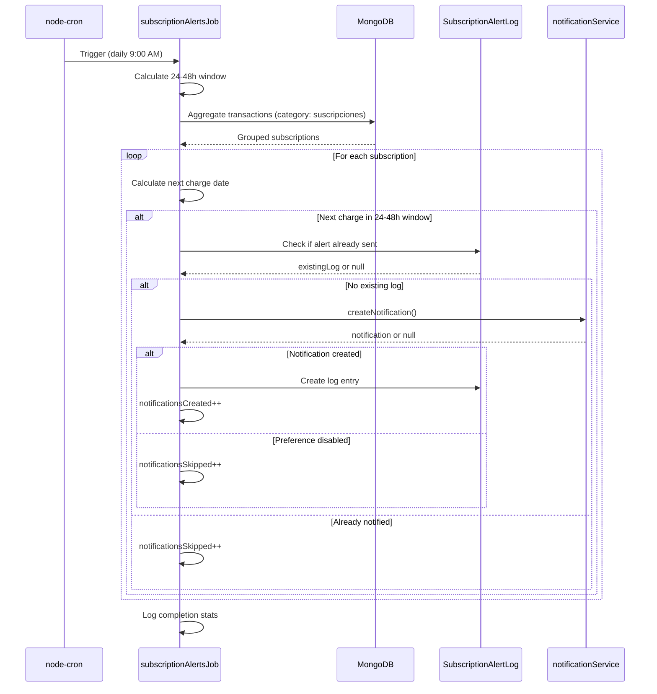
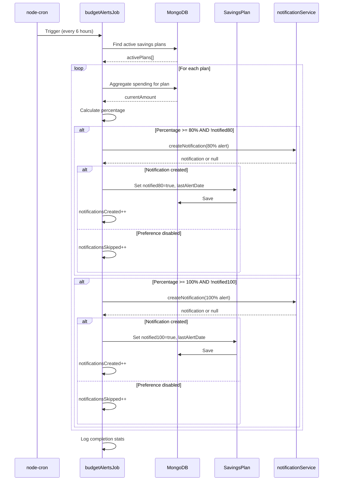
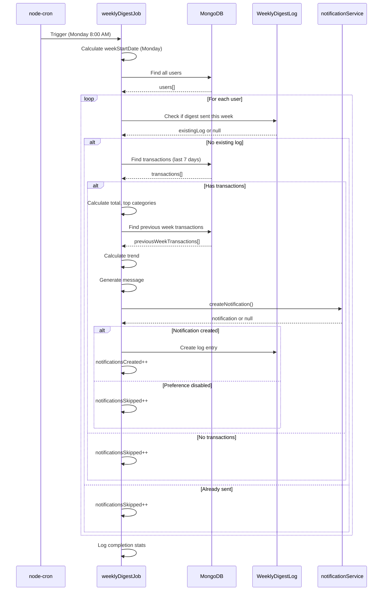

# Design Document: Notifications Backend - Phase 2 (Cron Jobs Automation)

## Overview

### Purpose

This phase implements automated notification generation through scheduled cron jobs that detect financial events and create notifications without manual intervention. The system will execute scheduled tasks for subscription alerts, budget threshold alerts, and weekly spending digests.

This is Phase 2 of Slice 8: Notificaciones y Alertas Inteligentes. Phase 1 (completed) implemented the backend API, models, and notification service. This phase builds upon that foundation to add automatic event detection and notification creation.

### Scope

**In Scope**:
- Three cron jobs: Subscription Alerts, Budget Alerts, Weekly Digest
- Job registry and initialization system
- Integration with existing notificationService.ts
- Idempotency mechanisms to prevent duplicate notifications
- Extension of SavingsPlan model for budget threshold tracking
- New models: WeeklyDigestLog, SubscriptionAlertLog
- Error handling and logging for job execution
- Timezone handling for Colombia (America/Bogota)
- Graceful shutdown of cron jobs

**Out of Scope**:
- Frontend UI for viewing notifications (Phase 3)
- Push notifications to mobile devices
- Email notifications
- SMS notifications
- Real-time WebSocket notifications
- Advanced analytics on notification engagement
- A/B testing of notification content

### Key Design Decisions

#### 1. Library Selection: node-cron

**Decision**: Use node-cron (^3.0.0) for scheduling cron jobs.

**Rationale**:

- **Simplicity**: node-cron provides a simple, cron-syntax-based API that's easy to understand and maintain
- **Lightweight**: No external dependencies (Redis, MongoDB) required for job scheduling
- **In-process**: Runs within the Node.js process, no separate worker infrastructure needed
- **Timezone support**: Built-in timezone handling for Colombia (America/Bogota)
- **Sufficient for MVP**: For the current scale (single server, predictable schedules), node-cron is adequate

**Alternatives considered**:
- **node-schedule**: Similar to node-cron but less intuitive syntax
- **agenda**: Requires MongoDB for job persistence, adds complexity for simple scheduled tasks
- **bull**: Requires Redis, overkill for time-based scheduling without queuing needs
- **AWS EventBridge/Cloud Scheduler**: External service dependency, increases infrastructure complexity

**Trade-offs accepted**:
- No job persistence: If server restarts, jobs restart on schedule (acceptable for time-based tasks)
- Single-server limitation: Horizontal scaling requires external scheduler (future consideration)
- No job history: Execution history not tracked by scheduler (we log manually)

#### 2. Idempotency Strategy

**Problem**: How to prevent duplicate notifications if server restarts during job execution or jobs run multiple times?

**Solution**: State tracking in MongoDB documents

**For Budget Alerts** (SavingsPlan model extension):

```typescript
// Extend SavingsPlan model with:
{
  notified80: boolean,      // default: false - Has 80% threshold been notified?
  notified100: boolean,     // default: false - Has 100% threshold been notified?
  lastAlertDate: Date       // optional - Last time any alert was sent
}
```

**Rationale**: Store threshold state directly in the plan document. When a plan reaches 80%, set `notified80: true`. When it reaches 100%, set `notified100: true`. This prevents duplicate alerts even if the job runs multiple times.

**For Weekly Digest** (new WeeklyDigestLog model):
```typescript
{
  userId: ObjectId,
  weekStartDate: Date,      // Monday of the week (normalized)
  sentAt: Date,
  // Unique index on (userId, weekStartDate)
}
```

**Rationale**: Track which weeks have been sent for each user. Before sending a digest, check if a log exists for that user + week combination. The unique index prevents race conditions.

**For Subscription Alerts** (new SubscriptionAlertLog model):
```typescript
{
  userId: ObjectId,
  merchant: string,
  expectedChargeDate: Date, // Normalized to date only (no time)
  sentAt: Date,
  // Unique index on (userId, merchant, expectedChargeDate)
}
```

**Rationale**: Track which subscription alerts have been sent. Before sending an alert for "Netflix charging on 2024-01-15", check if a log exists. The unique index prevents duplicates.

#### 3. Timezone Handling

**Decision**: Use 'America/Bogota' timezone for all scheduled jobs.

**Implementation**:

```typescript
cron.schedule('0 9 * * *', jobFunction, {
  timezone: 'America/Bogota'
});
```

**Rationale**: Users are in Colombia (UTC-5). Notifications should arrive at appropriate local times (9 AM for subscriptions, 8 AM for weekly digest), not UTC times.

#### 4. Job Execution Architecture

**Pattern**: Exportable execution function + cron schedule

```typescript
// Export the execution logic separately
export async function executeSubscriptionAlertsJob(): Promise<void> {
  // Job logic here
}

// Export the scheduled job
export const subscriptionAlertsJob = cron.schedule(
  '0 9 * * *',
  executeSubscriptionAlertsJob,
  { timezone: 'America/Bogota' }
);
```

**Benefits**:
- Testable: Can call `executeSubscriptionAlertsJob()` directly in tests
- Debuggable: Can manually trigger jobs without waiting for schedule
- Maintainable: Clear separation between scheduling and execution logic

## Architecture

### System Architecture

```
┌─────────────────────────────────────────────────────────────┐
│                     Express Application                      │
│                      (apps/api/src/)                         │
└─────────────────────────────────────────────────────────────┘
                              │
                              │ initializeJobs()
                              ▼
┌─────────────────────────────────────────────────────────────┐
│                      Job Registry                            │
│                  (apps/api/src/jobs/)                        │
│                                                              │
│  - initializeJobs()                                          │
│  - stopAllJobs()                                             │
│  - Registers all cron jobs                                   │
└─────────────────────────────────────────────────────────────┘
                              │
                ┌─────────────┼─────────────┐
                │             │             │
                ▼             ▼             ▼

    ┌──────────────────┐  ┌──────────────────┐  ┌──────────────────┐
    │ Subscription     │  │ Budget           │  │ Weekly           │
    │ Alerts Job       │  │ Alerts Job       │  │ Digest Job       │
    │                  │  │                  │  │                  │
    │ Daily 9:00 AM    │  │ Every 6 hours    │  │ Mon 8:00 AM      │
    └──────────────────┘  └──────────────────┘  └──────────────────┘
                │                  │                  │
                └──────────────────┼──────────────────┘
                                   │
                                   ▼
                    ┌──────────────────────────────┐
                    │   Notification Service       │
                    │   (existing from Phase 1)    │
                    │                              │
                    │   - createNotification()     │
                    │   - Respects preferences     │
                    └──────────────────────────────┘
                                   │
                                   ▼
                    ┌──────────────────────────────┐
                    │        MongoDB Atlas         │
                    │                              │
                    │   - notifications            │
                    │   - notificationPreferences  │
                    │   - savingsPlans (extended)  │
                    │   - weeklyDigestLogs (new)   │
                    │   - subscriptionAlertLogs    │
                    │   - transactions             │
                    │   - users                    │
                    └──────────────────────────────┘
```

### Folder Structure

```
apps/api/src/
├── jobs/
│   ├── index.ts                      # Job registry (initializeJobs, stopAllJobs)
│   ├── subscriptionAlertsJob.ts      # Subscription alerts cron job
│   ├── budgetAlertsJob.ts            # Budget threshold alerts cron job
│   └── weeklyDigestJob.ts            # Weekly spending digest cron job
├── models/
│   ├── SavingsPlan.ts                # Extended with notified80, notified100, lastAlertDate
│   ├── WeeklyDigestLog.ts            # New model for digest idempotency
│   ├── SubscriptionAlertLog.ts       # New model for subscription alert idempotency
│   ├── Notification.ts               # Existing (Phase 1)
│   ├── NotificationPreference.ts     # Existing (Phase 1)
│   ├── Transaction.ts                # Existing
│   └── User.ts                       # Existing
├── services/
│   └── notificationService.ts        # Existing (Phase 1) - reused by jobs
└── server.ts                         # Modified to call initializeJobs()
```

### Integration Points

1. **Server Startup** (server.ts):
   - After MongoDB connection succeeds
   - Call `initializeJobs()` to start all cron jobs
   - Register shutdown handlers to call `stopAllJobs()`

2. **Notification Service** (notificationService.ts):
   - Jobs import `createNotification()` function
   - Jobs respect user preferences automatically (handled by service)
   - Jobs handle null return value (preference disabled)

3. **Existing Models**:
   - Transaction: Query for subscription detection and spending analysis
   - SavingsPlan: Query for budget threshold detection (extended with tracking fields)
   - User: Query for active users in weekly digest
   - NotificationPreference: Automatically checked by notificationService

## Components and Interfaces

### 1. Job Registry (apps/api/src/jobs/index.ts)

```typescript
import cron from 'node-cron';
import { subscriptionAlertsJob } from './subscriptionAlertsJob';
import { budgetAlertsJob } from './budgetAlertsJob';
import { weeklyDigestJob } from './weeklyDigestJob';

// Store job instances for graceful shutdown
const jobs: cron.ScheduledTask[] = [];

/**
 * Initialize all cron jobs
 * Called from server.ts after MongoDB connection
 */
export function initializeJobs(): void {
  try {
    console.log('🕐 Initializing cron jobs...');

    // Start subscription alerts job
    subscriptionAlertsJob.start();
    jobs.push(subscriptionAlertsJob);
    console.log('✅ Subscription Alerts Job initialized (daily 9:00 AM Colombia)');

    // Start budget alerts job
    budgetAlertsJob.start();
    jobs.push(budgetAlertsJob);
    console.log('✅ Budget Alerts Job initialized (every 6 hours)');

    // Start weekly digest job
    weeklyDigestJob.start();
    jobs.push(weeklyDigestJob);
    console.log('✅ Weekly Digest Job initialized (Monday 8:00 AM Colombia)');

    console.log('🎉 All cron jobs initialized successfully');
  } catch (error) {
    console.error('❌ Error initializing cron jobs:', error);
    // Don't crash the server if jobs fail to initialize
  }
}

/**
 * Stop all running cron jobs
 * Called on server shutdown (SIGTERM, SIGINT)
 */
export function stopAllJobs(): void {
  console.log('🛑 Stopping all cron jobs...');
  
  jobs.forEach((job, index) => {
    try {
      job.stop();
      console.log(`✅ Job ${index + 1} stopped`);
    } catch (error) {
      console.error(`❌ Error stopping job ${index + 1}:`, error);
    }
  });
  
  console.log('🎉 All cron jobs stopped');
}
```

### 2. Subscription Alerts Job (apps/api/src/jobs/subscriptionAlertsJob.ts)

```typescript
import cron from 'node-cron';
import mongoose from 'mongoose';
import { Transaction } from '../models/Transaction';
import { SubscriptionAlertLog } from '../models/SubscriptionAlertLog';
import { createNotification } from '../services/notificationService';

/**
 * Subscription detection logic
 * Identifies subscriptions with next charge in 24-48 hours
 */
export async function executeSubscriptionAlertsJob(): Promise<void> {
  const startTime = Date.now();
  console.log('[Subscription Alerts Job] Starting execution...');

  try {
    // Calculate date range: 24-48 hours from now
    const now = new Date();
    const in24Hours = new Date(now.getTime() + 24 * 60 * 60 * 1000);
    const in48Hours = new Date(now.getTime() + 48 * 60 * 60 * 1000);

    // Query transactions with category 'suscripciones'
    // Group by userId and merchant to find recurring patterns
    const subscriptions = await Transaction.aggregate([
      {
        $match: {
          category: 'suscripciones'
        }
      },
      {
        $group: {
          _id: {
            userId: '$userId',
            merchant: '$merchant'
          },
          transactions: { $push: { date: '$date', amount: '$amount' } },
          avgAmount: { $avg: '$amount' },
          count: { $sum: 1 }
        }
      },
      {
        $match: {
          count: { $gte: 2 } // At least 2 transactions to identify pattern
        }
      }
    ]);

    let notificationsCreated = 0;
    let notificationsSkipped = 0;

    for (const sub of subscriptions) {
      const { userId, merchant } = sub._id;
      const transactions = sub.transactions;
      const avgAmount = sub.avgAmount;

      // Calculate next expected charge date based on transaction history
      // Sort transactions by date
      transactions.sort((a: any, b: any) => 
        new Date(a.date).getTime() - new Date(b.date).getTime()
      );

      // Calculate average interval between charges (in days)
      let totalInterval = 0;
      for (let i = 1; i < transactions.length; i++) {
        const diff = new Date(transactions[i].date).getTime() - 
                     new Date(transactions[i-1].date).getTime();
        totalInterval += diff / (1000 * 60 * 60 * 24); // Convert to days
      }
      const avgInterval = totalInterval / (transactions.length - 1);

      // Predict next charge date
      const lastChargeDate = new Date(transactions[transactions.length - 1].date);
      const nextChargeDate = new Date(
        lastChargeDate.getTime() + avgInterval * 24 * 60 * 60 * 1000
      );

      // Check if next charge is in 24-48 hour window
      if (nextChargeDate >= in24Hours && nextChargeDate <= in48Hours) {
        // Normalize date to midnight for idempotency check
        const normalizedDate = new Date(nextChargeDate);
        normalizedDate.setHours(0, 0, 0, 0);

        // Check if alert already sent for this subscription + date
        const existingLog = await SubscriptionAlertLog.findOne({
          userId: new mongoose.Types.ObjectId(userId),
          merchant,
          expectedChargeDate: normalizedDate
        });

        if (existingLog) {
          notificationsSkipped++;
          continue; // Already notified
        }

        // Create notification
        const notification = await createNotification({
          userId: userId.toString(),
          type: 'subscription',
          title: 'Renovación de suscripción próxima',
          message: `Tu suscripción a ${merchant} se renovará pronto por aproximadamente $${Math.round(avgAmount).toLocaleString('es-CO')} COP. Revisa si deseas mantenerla.`,
          actionUrl: '/subscriptions'
        });

        if (notification) {
          // Log the alert to prevent duplicates
          await SubscriptionAlertLog.create({
            userId: new mongoose.Types.ObjectId(userId),
            merchant,
            expectedChargeDate: normalizedDate,
            sentAt: new Date()
          });
          notificationsCreated++;
        } else {
          notificationsSkipped++; // User has preference disabled
        }
      }
    }

    const duration = Date.now() - startTime;
    console.log(
      `[Subscription Alerts Job] Completed in ${duration}ms. ` +
      `Created: ${notificationsCreated}, Skipped: ${notificationsSkipped}`
    );
  } catch (error) {
    console.error('[Subscription Alerts Job] Error:', error);
    // Don't throw - let job continue on schedule
  }
}

/**
 * Cron job: Daily at 9:00 AM Colombia time
 */
export const subscriptionAlertsJob = cron.schedule(
  '0 9 * * *',
  executeSubscriptionAlertsJob,
  {
    timezone: 'America/Bogota',
    scheduled: false // Don't start automatically, wait for initializeJobs()
  }
);
```

### 3. Budget Alerts Job (apps/api/src/jobs/budgetAlertsJob.ts)

```typescript
import cron from 'node-cron';
import mongoose from 'mongoose';
import { SavingsPlan } from '../models/SavingsPlan';
import { Transaction } from '../models/Transaction';
import { createNotification } from '../services/notificationService';

/**
 * Budget threshold detection logic
 * Checks active savings plans and sends alerts at 80% and 100% thresholds
 */
export async function executeBudgetAlertsJob(): Promise<void> {
  const startTime = Date.now();
  console.log('[Budget Alerts Job] Starting execution...');

  try {
    // Query all active savings plans
    const activePlans = await SavingsPlan.find({ status: 'active' });

    let notificationsCreated = 0;
    let notificationsSkipped = 0;

    for (const plan of activePlans) {
      // Calculate current spending for this plan
      const startDate = new Date(plan.startDate);
      const endDate = new Date(plan.endDate);

      const spending = await Transaction.aggregate([
        {
          $match: {
            userId: plan.userId,
            category: plan.category.toLowerCase(),
            date: {
              $gte: startDate.toISOString(),
              $lte: endDate.toISOString()
            }
          }
        },
        {
          $group: {
            _id: null,
            total: { $sum: '$amount' }
          }
        }
      ]);

      const currentAmount = spending.length > 0 ? spending[0].total : 0;
      const percentage = (currentAmount / plan.targetAmount) * 100;

      // Check 80% threshold
      if (percentage >= 80 && percentage < 100 && !plan.notified80) {
        const notification = await createNotification({
          userId: plan.userId.toString(),
          type: 'plan_alert',
          title: '⚠️ Alerta de presupuesto: 80% alcanzado',
          message: `Has gastado $${Math.round(currentAmount).toLocaleString('es-CO')} COP de tu presupuesto de $${plan.targetAmount.toLocaleString('es-CO')} COP en ${plan.category}. ¡Cuidado con los gastos restantes!`,
          actionUrl: '/plans'
        });

        if (notification) {
          // Mark threshold as notified
          plan.notified80 = true;
          plan.lastAlertDate = new Date();
          await plan.save();
          notificationsCreated++;
        } else {
          notificationsSkipped++;
        }
      }

      // Check 100% threshold
      if (percentage >= 100 && !plan.notified100) {
        const notification = await createNotification({
          userId: plan.userId.toString(),
          type: 'plan_alert',
          title: '🚨 Presupuesto excedido',
          message: `Has superado tu presupuesto de $${plan.targetAmount.toLocaleString('es-CO')} COP en ${plan.category}. Gasto actual: $${Math.round(currentAmount).toLocaleString('es-CO')} COP.`,
          actionUrl: '/plans'
        });

        if (notification) {
          // Mark threshold as notified
          plan.notified100 = true;
          plan.lastAlertDate = new Date();
          await plan.save();
          notificationsCreated++;
        } else {
          notificationsSkipped++;
        }
      }
    }

    const duration = Date.now() - startTime;
    console.log(
      `[Budget Alerts Job] Completed in ${duration}ms. ` +
      `Created: ${notificationsCreated}, Skipped: ${notificationsSkipped}`
    );
  } catch (error) {
    console.error('[Budget Alerts Job] Error:', error);
    // Don't throw - let job continue on schedule
  }
}

/**
 * Cron job: Every 6 hours
 */
export const budgetAlertsJob = cron.schedule(
  '0 */6 * * *',
  executeBudgetAlertsJob,
  {
    scheduled: false // Don't start automatically, wait for initializeJobs()
  }
);
```

### 4. Weekly Digest Job (apps/api/src/jobs/weeklyDigestJob.ts)

```typescript
import cron from 'node-cron';
import mongoose from 'mongoose';
import { User } from '../models/User';
import { Transaction } from '../models/Transaction';
import { WeeklyDigestLog } from '../models/WeeklyDigestLog';
import { createNotification } from '../services/notificationService';

/**
 * Get Monday of current week (normalized to midnight)
 */
function getMondayOfWeek(date: Date): Date {
  const d = new Date(date);
  const day = d.getDay();
  const diff = d.getDate() - day + (day === 0 ? -6 : 1); // Adjust when day is Sunday
  const monday = new Date(d.setDate(diff));
  monday.setHours(0, 0, 0, 0);
  return monday;
}

/**
 * Weekly spending digest logic
 * Analyzes previous 7 days and sends summary to all active users
 */
export async function executeWeeklyDigestJob(): Promise<void> {
  const startTime = Date.now();
  console.log('[Weekly Digest Job] Starting execution...');

  try {
    // Get all users
    const users = await User.find({});

    // Calculate date range: previous 7 days
    const now = new Date();
    const sevenDaysAgo = new Date(now.getTime() - 7 * 24 * 60 * 60 * 1000);

    // Get Monday of current week for idempotency
    const weekStartDate = getMondayOfWeek(now);

    let notificationsCreated = 0;
    let notificationsSkipped = 0;

    for (const user of users) {
      // Check if digest already sent for this week
      const existingLog = await WeeklyDigestLog.findOne({
        userId: user._id,
        weekStartDate
      });

      if (existingLog) {
        notificationsSkipped++;
        continue; // Already sent this week
      }

      // Query transactions for previous 7 days
      const transactions = await Transaction.find({
        userId: user._id,
        date: {
          $gte: sevenDaysAgo.toISOString(),
          $lte: now.toISOString()
        }
      });

      // Skip users with no transactions
      if (transactions.length === 0) {
        notificationsSkipped++;
        continue;
      }

      // Calculate total spending
      const totalSpending = transactions.reduce((sum, t) => sum + t.amount, 0);

      // Get top 3 categories
      const categoryTotals = transactions.reduce((acc: any, t) => {
        const cat = t.category || 'misceláneos';
        acc[cat] = (acc[cat] || 0) + t.amount;
        return acc;
      }, {});

      const topCategories = Object.entries(categoryTotals)
        .sort(([, a]: any, [, b]: any) => b - a)
        .slice(0, 3)
        .map(([cat, amount]: any) => `${cat} ($${Math.round(amount).toLocaleString('es-CO')} COP)`);

      // Calculate trend (compare to previous week)
      const fourteenDaysAgo = new Date(now.getTime() - 14 * 24 * 60 * 60 * 1000);
      const previousWeekTransactions = await Transaction.find({
        userId: user._id,
        date: {
          $gte: fourteenDaysAgo.toISOString(),
          $lt: sevenDaysAgo.toISOString()
        }
      });

      const previousWeekSpending = previousWeekTransactions.reduce(
        (sum, t) => sum + t.amount,
        0
      );

      let trend = 'estable';
      if (totalSpending > previousWeekSpending * 1.1) {
        trend = 'al alza';
      } else if (totalSpending < previousWeekSpending * 0.9) {
        trend = 'a la baja';
      }

      // Generate message
      const message = 
        `Esta semana gastaste $${Math.round(totalSpending).toLocaleString('es-CO')} COP. ` +
        `Tus principales categorías fueron: ${topCategories.join(', ')}. ` +
        `Tendencia: ${trend} respecto a la semana anterior.`;

      // Create notification
      const notification = await createNotification({
        userId: user._id.toString(),
        type: 'weekly_digest',
        title: 'Resumen Semanal de Gastos',
        message,
        actionUrl: '/analysis'
      });

      if (notification) {
        // Log the digest to prevent duplicates
        await WeeklyDigestLog.create({
          userId: user._id,
          weekStartDate,
          sentAt: new Date()
        });
        notificationsCreated++;
      } else {
        notificationsSkipped++; // User has preference disabled
      }
    }

    const duration = Date.now() - startTime;
    console.log(
      `[Weekly Digest Job] Completed in ${duration}ms. ` +
      `Created: ${notificationsCreated}, Skipped: ${notificationsSkipped}`
    );
  } catch (error) {
    console.error('[Weekly Digest Job] Error:', error);
    // Don't throw - let job continue on schedule
  }
}

/**
 * Cron job: Every Monday at 8:00 AM Colombia time
 */
export const weeklyDigestJob = cron.schedule(
  '0 8 * * 1',
  executeWeeklyDigestJob,
  {
    timezone: 'America/Bogota',
    scheduled: false // Don't start automatically, wait for initializeJobs()
  }
);
```

## Data Models

### 1. SavingsPlan Model Extension

Extend the existing SavingsPlan model with budget threshold tracking fields:

```typescript
// apps/api/src/models/SavingsPlan.ts
export interface ISavingsPlan extends Document {
  userId: mongoose.Types.ObjectId;
  category: string;
  targetAmount: number;
  currentAmount: number;
  startDate: Date;
  endDate: Date;
  status: 'active' | 'completed' | 'failed';
  
  // NEW FIELDS FOR PHASE 2
  notified80?: boolean;      // Has 80% threshold been notified?
  notified100?: boolean;     // Has 100% threshold been notified?
  lastAlertDate?: Date;      // Last time any alert was sent
  
  createdAt: Date;
  updatedAt: Date;
  getProgressPercentage(): number;
  updateStatus(): void;
}

const SavingsPlanSchema = new Schema<ISavingsPlan>(
  {
    // ... existing fields ...
    
    // NEW FIELDS
    notified80: {
      type: Boolean,
      default: false
    },
    notified100: {
      type: Boolean,
      default: false
    },
    lastAlertDate: {
      type: Date
    }
  },
  {
    timestamps: true,
    collection: 'savingsPlans'
  }
);
```

**Backward Compatibility**: Existing documents without these fields will have `undefined` values, which are falsy in JavaScript. The job checks `!plan.notified80`, which evaluates to `true` for both `false` and `undefined`, so no migration is needed.

### 2. WeeklyDigestLog Model (NEW)

```typescript
// apps/api/src/models/WeeklyDigestLog.ts
import mongoose, { Document, Schema } from 'mongoose';

export interface IWeeklyDigestLog extends Document {
  userId: mongoose.Types.ObjectId;
  weekStartDate: Date;  // Monday of the week (normalized to midnight)
  sentAt: Date;
  createdAt: Date;
  updatedAt: Date;
}

const weeklyDigestLogSchema = new Schema<IWeeklyDigestLog>(
  {
    userId: {
      type: Schema.Types.ObjectId,
      ref: 'User',
      required: true,
      index: true
    },
    weekStartDate: {
      type: Date,
      required: true,
      index: true
    },
    sentAt: {
      type: Date,
      required: true,
      default: Date.now
    }
  },
  {
    timestamps: true,
    collection: 'weeklyDigestLogs'
  }
);

// Unique index to prevent duplicate digests for same user + week
weeklyDigestLogSchema.index(
  { userId: 1, weekStartDate: 1 },
  { unique: true }
);

export const WeeklyDigestLog = mongoose.model<IWeeklyDigestLog>(
  'WeeklyDigestLog',
  weeklyDigestLogSchema
);
```

**Purpose**: Track which weekly digests have been sent to prevent duplicates.

**Idempotency**: The unique index on `(userId, weekStartDate)` ensures that only one digest can be logged per user per week. If the job runs multiple times on Monday, subsequent attempts will fail the unique constraint check.

### 3. SubscriptionAlertLog Model (NEW)

```typescript
// apps/api/src/models/SubscriptionAlertLog.ts
import mongoose, { Document, Schema } from 'mongoose';

export interface ISubscriptionAlertLog extends Document {
  userId: mongoose.Types.ObjectId;
  merchant: string;
  expectedChargeDate: Date;  // Normalized to date only (midnight)
  sentAt: Date;
  createdAt: Date;
  updatedAt: Date;
}

const subscriptionAlertLogSchema = new Schema<ISubscriptionAlertLog>(
  {
    userId: {
      type: Schema.Types.ObjectId,
      ref: 'User',
      required: true,
      index: true
    },
    merchant: {
      type: String,
      required: true,
      trim: true
    },
    expectedChargeDate: {
      type: Date,
      required: true,
      index: true
    },
    sentAt: {
      type: Date,
      required: true,
      default: Date.now
    }
  },
  {
    timestamps: true,
    collection: 'subscriptionAlertLogs'
  }
);

// Unique index to prevent duplicate alerts for same subscription + date
subscriptionAlertLogSchema.index(
  { userId: 1, merchant: 1, expectedChargeDate: 1 },
  { unique: true }
);

export const SubscriptionAlertLog = mongoose.model<ISubscriptionAlertLog>(
  'SubscriptionAlertLog',
  subscriptionAlertLogSchema
);
```

**Purpose**: Track which subscription alerts have been sent to prevent duplicates.

**Idempotency**: The unique index on `(userId, merchant, expectedChargeDate)` ensures that only one alert can be logged per subscription per expected charge date. If the job detects the same subscription renewal multiple times, subsequent attempts will fail the unique constraint check.

## Job Execution Flow

### Subscription Alerts Job Flow



### Budget Alerts Job Flow



### Weekly Digest Job Flow




## Error Handling and Logging

### Error Handling Strategy

All cron jobs follow a consistent error handling pattern:

```typescript
export async function executeJobName(): Promise<void> {
  const startTime = Date.now();
  console.log('[Job Name] Starting execution...');

  try {
    // Job logic here
    
    const duration = Date.now() - startTime;
    console.log(
      `[Job Name] Completed in ${duration}ms. ` +
      `Created: ${notificationsCreated}, Skipped: ${notificationsSkipped}`
    );
  } catch (error) {
    console.error('[Job Name] Error:', error);
    // Don't throw - let job continue on schedule
  }
}
```

**Key principles**:
1. **Wrap everything in try-catch**: All job logic is wrapped to prevent unhandled exceptions
2. **Log errors, don't throw**: Errors are logged with `console.error` but not re-thrown
3. **Continue on schedule**: Even if a job fails, the next scheduled execution will still occur
4. **Structured logging**: All logs include job name, timestamp, and relevant metrics

### Logging Format

**Informational logs** (console.log):
- Job start: `[Job Name] Starting execution...`
- Job completion: `[Job Name] Completed in ${duration}ms. Created: ${count}, Skipped: ${count}`
- Registry initialization: `✅ Job Name initialized (schedule details)`

**Error logs** (console.error):
- Job errors: `[Job Name] Error:`, followed by error object
- Registry errors: `❌ Error initializing cron jobs:`, followed by error object

### Error Scenarios

1. **MongoDB connection failure**: Job catches error, logs it, continues on next schedule
2. **Invalid data in database**: Job skips invalid records, logs warning, continues processing
3. **notificationService throws**: Job catches error, logs it, continues to next user/plan
4. **Aggregation pipeline fails**: Job catches error, logs it, entire execution fails gracefully

## Performance Considerations

### Query Optimization

**Indexed queries**:
- All queries use indexed fields (userId, date, category, status)
- Compound indexes optimize common query patterns
- Aggregation pipelines leverage indexes for $match stages

**Example optimized query**:
```typescript
// Uses index: { userId: 1, category: 1 }
const spending = await Transaction.aggregate([
  {
    $match: {
      userId: plan.userId,
      category: plan.category.toLowerCase(),
      date: { $gte: startDate, $lte: endDate }
    }
  },
  {
    $group: {
      _id: null,
      total: { $sum: '$amount' }
    }
  }
]);
```

### Batch Processing

For MVP (Phase 2), jobs process all users/plans sequentially. For future scalability:

**Current approach** (MVP):
```typescript
for (const user of users) {
  // Process user
}
```

**Future optimization** (Phase 3+):
```typescript
const BATCH_SIZE = 100;
for (let i = 0; i < users.length; i += BATCH_SIZE) {
  const batch = users.slice(i, i + BATCH_SIZE);
  await Promise.all(batch.map(user => processUser(user)));
}
```

### Execution Time Estimates

Based on typical MongoDB query performance:

- **Subscription Alerts Job**: ~2-5 seconds for 1000 users (aggregation + log checks)
- **Budget Alerts Job**: ~5-10 seconds for 1000 active plans (aggregation per plan)
- **Weekly Digest Job**: ~10-20 seconds for 1000 users (multiple queries per user)

All jobs should complete well within their schedule intervals.

### Memory Management

**Current approach**:
- Load all users/plans into memory (acceptable for MVP with <10,000 users)
- Process sequentially to avoid memory spikes

**Future optimization**:
- Use MongoDB cursors for streaming large result sets
- Process in batches to limit memory usage
- Implement pagination for very large user bases

## Idempotency Strategy (Detailed)

### Why Idempotency Matters

**Problem scenarios**:
1. Server restarts during job execution
2. Job runs multiple times due to scheduling issues
3. Manual job triggering for testing/debugging
4. Clock skew or timezone issues

**Without idempotency**: Users receive duplicate notifications, degrading trust and experience.

**With idempotency**: Each notification is sent exactly once, even if jobs run multiple times.

### Idempotency Mechanisms

#### 1. Budget Alerts: State in SavingsPlan Document

**Approach**: Store notification state directly in the plan document.

```typescript
// Before creating notification
if (percentage >= 80 && !plan.notified80) {
  // Create notification
  // Update state
  plan.notified80 = true;
  plan.lastAlertDate = new Date();
  await plan.save();
}
```

**Benefits**:
- Simple: No additional collections needed
- Atomic: State update happens with notification creation
- Self-documenting: Plan document shows notification history

**Trade-offs**:
- State persists even if plan is reset (acceptable - prevents spam)
- No history of when notifications were sent (lastAlertDate provides some info)

#### 2. Weekly Digest: Log Collection with Unique Index

**Approach**: Create a log entry for each sent digest, with unique constraint.

```typescript
// Before creating notification
const existingLog = await WeeklyDigestLog.findOne({
  userId: user._id,
  weekStartDate
});

if (existingLog) {
  continue; // Already sent
}

// Create notification
// Create log
await WeeklyDigestLog.create({
  userId: user._id,
  weekStartDate,
  sentAt: new Date()
});
```

**Benefits**:
- Audit trail: Complete history of sent digests
- Flexible: Can query logs for analytics
- Race condition safe: Unique index prevents duplicates even with concurrent jobs

**Trade-offs**:
- Additional collection: More storage and queries
- Cleanup needed: Old logs should be archived/deleted periodically

#### 3. Subscription Alerts: Log Collection with Composite Unique Index

**Approach**: Similar to weekly digest, but with composite key (userId + merchant + date).

```typescript
// Before creating notification
const existingLog = await SubscriptionAlertLog.findOne({
  userId: new mongoose.Types.ObjectId(userId),
  merchant,
  expectedChargeDate: normalizedDate
});

if (existingLog) {
  continue; // Already sent
}

// Create notification
// Create log
await SubscriptionAlertLog.create({
  userId: new mongoose.Types.ObjectId(userId),
  merchant,
  expectedChargeDate: normalizedDate,
  sentAt: new Date()
});
```

**Benefits**:
- Precise tracking: One log per subscription per expected charge date
- Handles multiple subscriptions: Same merchant, different dates tracked separately
- Race condition safe: Unique index on (userId, merchant, expectedChargeDate)

**Trade-offs**:
- Additional collection: More storage and queries
- Date normalization critical: Must normalize to midnight to avoid time-of-day duplicates

### Date Normalization

**Critical for idempotency**: Dates must be normalized to avoid duplicates due to time-of-day differences.

```typescript
// Normalize to midnight
const normalizedDate = new Date(nextChargeDate);
normalizedDate.setHours(0, 0, 0, 0);
```

**Why**: If job runs at 9:00 AM and 9:05 AM, `new Date()` will have different times. Normalizing to midnight ensures consistent comparison.

### Unique Index Race Conditions

**Scenario**: Two job instances run simultaneously (e.g., during deployment).

**Protection**: MongoDB unique indexes are atomic. If two instances try to insert the same log entry:
1. First instance succeeds
2. Second instance gets duplicate key error
3. Second instance catches error, skips notification

**Implementation**:
```typescript
try {
  await SubscriptionAlertLog.create({ ... });
  notificationsCreated++;
} catch (error) {
  if (error.code === 11000) {
    // Duplicate key error - already sent
    notificationsSkipped++;
  } else {
    throw error; // Re-throw other errors
  }
}
```

## Testing Strategy

### Dual Testing Approach

The cron jobs system requires both unit tests and property-based tests:

#### 1. Unit Tests (Vitest)

**Purpose**: Verify specific examples, configuration, and integration points.

**Test cases**:
- Cron schedule configuration (correct expressions, timezones)
- Job registry initialization and shutdown
- Logging behavior (correct messages, error handling)
- Model schema extensions (new fields, defaults)
- Integration with notificationService
- Idempotency log creation

**Example**:
```typescript
// apps/api/src/jobs/subscriptionAlertsJob.test.ts
import { describe, it, expect, beforeEach, afterEach, vi } from 'vitest';
import { executeSubscriptionAlertsJob } from './subscriptionAlertsJob';
import { Transaction } from '../models/Transaction';
import { SubscriptionAlertLog } from '../models/SubscriptionAlertLog';
import { createNotification } from '../services/notificationService';

vi.mock('../services/notificationService');

describe('subscriptionAlertsJob', () => {
  beforeEach(async () => {
    await Transaction.deleteMany({});
    await SubscriptionAlertLog.deleteMany({});
  });

  it('should detect subscription expiring in 24-48 hours', async () => {
    const userId = new mongoose.Types.ObjectId();
    const now = new Date();
    const thirtyDaysAgo = new Date(now.getTime() - 30 * 24 * 60 * 60 * 1000);
    const sixtyDaysAgo = new Date(now.getTime() - 60 * 24 * 60 * 60 * 1000);

    // Create recurring transactions (Netflix, monthly)
    await Transaction.create([
      {
        userId,
        merchant: 'Netflix',
        category: 'suscripciones',
        amount: 45000,
        date: sixtyDaysAgo.toISOString(),
        description: 'Netflix subscription'
      },
      {
        userId,
        merchant: 'Netflix',
        category: 'suscripciones',
        amount: 45000,
        date: thirtyDaysAgo.toISOString(),
        description: 'Netflix subscription'
      }
    ]);

    // Mock createNotification to return notification
    vi.mocked(createNotification).mockResolvedValue({
      _id: 'notification-id',
      userId,
      type: 'subscription',
      title: 'Test',
      message: 'Test',
      read: false
    } as any);

    await executeSubscriptionAlertsJob();

    // Verify createNotification was called
    expect(createNotification).toHaveBeenCalledWith(
      expect.objectContaining({
        userId: userId.toString(),
        type: 'subscription',
        actionUrl: '/subscriptions'
      })
    );

    // Verify log was created
    const log = await SubscriptionAlertLog.findOne({
      userId,
      merchant: 'Netflix'
    });
    expect(log).not.toBeNull();
  });

  it('should not create duplicate alerts', async () => {
    const userId = new mongoose.Types.ObjectId();
    const expectedDate = new Date();
    expectedDate.setHours(0, 0, 0, 0);

    // Create existing log
    await SubscriptionAlertLog.create({
      userId,
      merchant: 'Netflix',
      expectedChargeDate: expectedDate,
      sentAt: new Date()
    });

    // Create transactions that would trigger alert
    // ... (same as above)

    await executeSubscriptionAlertsJob();

    // Verify createNotification was NOT called
    expect(createNotification).not.toHaveBeenCalled();
  });
});
```

#### 2. Property-Based Tests (fast-check)

**Purpose**: Verify universal properties across many generated inputs.

**Configuration**:
- Minimum 100 iterations per test (`numRuns: 100`)
- Tag with feature name and property number
- Generators for complex data types

**Example**:
```typescript
// apps/api/src/jobs/budgetAlertsJob.property.test.ts
import { describe, it, expect } from 'vitest';
import fc from 'fast-check';
import { executeBudgetAlertsJob } from './budgetAlertsJob';
import { SavingsPlan } from '../models/SavingsPlan';
import { Transaction } from '../models/Transaction';

// Feature: notifications-cron-f2, Property 1: Budget threshold detection
describe('Property 1: Budget threshold detection', () => {
  it('should detect 80% threshold for all plans reaching 80%', () => {
    fc.assert(
      fc.property(
        fc.record({
          userId: fc.constant(new mongoose.Types.ObjectId()),
          category: fc.constantFrom('café/bebidas', 'comida', 'transporte'),
          targetAmount: fc.integer({ min: 100000, max: 1000000 }),
          spendingPercentage: fc.integer({ min: 80, max: 99 })
        }),
        async ({ userId, category, targetAmount, spendingPercentage }) => {
          // Create plan
          const plan = await SavingsPlan.create({
            userId,
            category,
            targetAmount,
            currentAmount: 0,
            startDate: new Date(),
            endDate: new Date(Date.now() + 30 * 24 * 60 * 60 * 1000),
            status: 'active',
            notified80: false,
            notified100: false
          });

          // Create transactions to reach percentage
          const spendingAmount = (targetAmount * spendingPercentage) / 100;
          await Transaction.create({
            userId,
            category,
            amount: spendingAmount,
            date: new Date().toISOString(),
            description: 'Test transaction'
          });

          // Execute job
          await executeBudgetAlertsJob();

          // Verify notification was created and state updated
          const updatedPlan = await SavingsPlan.findById(plan._id);
          expect(updatedPlan.notified80).toBe(true);
        }
      ),
      { numRuns: 100 }
    );
  });
});

// Feature: notifications-cron-f2, Property 2: Idempotency for budget alerts
describe('Property 2: Idempotency for budget alerts', () => {
  it('should not create duplicate 80% alerts', () => {
    fc.assert(
      fc.property(
        fc.record({
          userId: fc.constant(new mongoose.Types.ObjectId()),
          category: fc.constantFrom('café/bebidas', 'comida', 'transporte'),
          targetAmount: fc.integer({ min: 100000, max: 1000000 }),
          executionCount: fc.integer({ min: 2, max: 5 })
        }),
        async ({ userId, category, targetAmount, executionCount }) => {
          // Create plan at 80%
          const plan = await SavingsPlan.create({
            userId,
            category,
            targetAmount,
            currentAmount: 0,
            startDate: new Date(),
            endDate: new Date(Date.now() + 30 * 24 * 60 * 60 * 1000),
            status: 'active',
            notified80: false
          });

          // Create transactions to reach 80%
          await Transaction.create({
            userId,
            category,
            amount: targetAmount * 0.8,
            date: new Date().toISOString(),
            description: 'Test'
          });

          // Execute job multiple times
          for (let i = 0; i < executionCount; i++) {
            await executeBudgetAlertsJob();
          }

          // Verify only one notification was created
          const notifications = await Notification.find({
            userId,
            type: 'plan_alert'
          });
          expect(notifications.length).toBe(1);
        }
      ),
      { numRuns: 100 }
    );
  });
});
```

### Test Coverage Goals

- **Job execution functions**: 80% code coverage minimum
- **Job registry**: 70% code coverage minimum
- **Property tests**: All identified properties implemented
- **Integration tests**: Server startup with job initialization

## Correctness Properties

*A property is a characteristic or behavior that should hold true across all valid executions of a system—essentially, a formal statement about what the system should do. Properties serve as the bridge between human-readable specifications and machine-verifiable correctness guarantees.*

### Property Reflection

After analyzing all acceptance criteria, I identified the following redundancies:

**Redundancies identified**:
1. Criteria 1.5, 2.6, 3.7, 12.5 are all about respecting user preferences - can be combined into one property
2. Criteria 1.6, 12.3 are about handling null returns from createNotification - can be combined
3. Criteria 1.8, 2.9, 3.10, 5.6 are all about error handling without crashing - can be combined
4. Criteria 4.6, 4.7 are about job registry error handling - can be combined
5. Criteria 7.1, 7.2, 7.3 are all about subscription detection logic - can be combined into comprehensive property
6. Criteria 8.1, 8.2, 8.3, 8.4 are all about budget threshold tracking - can be combined
7. Criteria 9.1, 9.2, 9.3, 9.4 are all about weekly digest calculations - can be combined
8. Criteria 1.3, 7.4 are the same (24-48h window detection) - combine
9. Criteria 2.4, 8.2 are the same (80% threshold) - combine
10. Criteria 2.5, 8.3 are the same (100% threshold) - combine

**Properties consolidated**:
- User preference respect: One property covering all job types
- Error handling: One property covering all jobs
- Threshold detection: One property covering both 80% and 100%
- Subscription detection: One comprehensive property for the full pipeline
- Weekly digest calculations: One property covering all metrics

### Property 1: Subscription Detection Pipeline

*For any* set of transactions with category 'suscripciones', the job should correctly group by merchant, calculate average interval between charges, predict next charge date, and identify subscriptions with next charge in 24-48 hour window.

**Validates: Requirements 1.2, 1.3, 7.1, 7.2, 7.3, 7.4**

### Property 2: Subscription Alert Creation

*For any* expiring subscription (next charge in 24-48h), if no alert log exists for that userId + merchant + date combination, the job should create a notification with type 'subscription', actionUrl '/subscriptions', and message containing merchant name and estimated amount.

**Validates: Requirements 1.4, 7.5, 7.6**

### Property 3: Subscription Alert Idempotency

*For any* subscription alert that has already been logged (SubscriptionAlertLog exists), the job should skip notification creation even if the subscription is detected again.

**Validates: Requirements 1.2, 1.3**

### Property 4: Budget Threshold Detection

*For any* active savings plan, the job should calculate current spending percentage, and if percentage >= 80% with notified80=false OR percentage >= 100% with notified100=false, create a plan_alert notification and update the corresponding notified flag.

**Validates: Requirements 2.2, 2.3, 2.4, 2.5, 8.2, 8.3**

### Property 5: Budget Alert Idempotency

*For any* savings plan with notified80=true, the job should not create another 80% alert even if spending remains >= 80%. Same for notified100=true and 100% threshold.

**Validates: Requirements 2.7, 8.1, 8.4**

### Property 6: Budget Alert State Persistence

*For any* budget alert created, the job should update the plan document with the appropriate notified flag (notified80 or notified100) and lastAlertDate before completing.

**Validates: Requirements 8.1, 8.2, 8.3**

### Property 7: Weekly Digest User Query

*For any* execution of the weekly digest job, the job should query all users in the database without filtering by status or other criteria.

**Validates: Requirements 3.2**

### Property 8: Weekly Digest Date Range

*For any* user processed by the weekly digest job, the job should query transactions from exactly the previous 7 days (now - 7 days to now).

**Validates: Requirements 3.3**

### Property 9: Weekly Digest Calculations

*For any* user with transactions in the previous 7 days, the job should correctly calculate total spending (sum of amounts), top 3 categories (sorted by total amount), and trend (comparing to previous 7 days: up if >10% increase, down if >10% decrease, stable otherwise).

**Validates: Requirements 3.4, 9.1, 9.2, 9.3**

### Property 10: Weekly Digest Message Format

*For any* weekly digest notification created, the message should include total spending formatted in COP, list of top categories with amounts, trend description, and be written in Spanish. The title should be "Resumen Semanal de Gastos" and actionUrl should be '/analysis'.

**Validates: Requirements 3.5, 9.4, 9.5, 9.6, 9.7**

### Property 11: Weekly Digest User Filtering

*For any* user with zero transactions in the previous 7 days, the job should skip that user and not create a notification.

**Validates: Requirements 3.8**

### Property 12: Weekly Digest Idempotency

*For any* user + week combination where a WeeklyDigestLog already exists, the job should skip notification creation even if executed multiple times.

**Validates: Requirements 3.1, 3.2**

### Property 13: User Preference Respect

*For any* notification creation attempt by any job, if the user's preference for that notification type is disabled (subscriptionAlerts=false, planAlerts=false, or weeklyDigest=false), the notificationService should return null and the job should skip that notification without error.

**Validates: Requirements 1.5, 2.6, 3.7, 12.5**

### Property 14: Null Return Handling

*For any* call to createNotification that returns null (preference disabled), the job should continue execution without throwing an error and increment the skipped counter.

**Validates: Requirements 1.6, 12.3**

### Property 15: Error Handling Without Crash

*For any* error thrown during job execution (database errors, validation errors, etc.), the job should catch the error, log it with console.error including job name and error details, and not re-throw the error, allowing the next scheduled execution to proceed.

**Validates: Requirements 1.8, 2.9, 3.10, 5.2, 5.5, 5.6**

### Property 16: CreateNotification API Contract

*For any* call to createNotification from a job, the data parameter should conform to CreateNotificationData interface with valid userId (ObjectId string), type (matching job type), non-empty title and message, and optional actionUrl.

**Validates: Requirements 12.2**

### Property 17: Job Registry Error Isolation

*For any* job that fails to initialize (throws error during start()), the job registry should catch the error, log it, and continue initializing remaining jobs without crashing the server.

**Validates: Requirements 4.6, 4.7**

### Property 18: Graceful Shutdown

*For any* call to stopAllJobs(), the registry should call stop() on each registered job, catch any errors from individual stop() calls, log them, and continue stopping remaining jobs.

**Validates: Requirements 14.3**

### Property 19: SavingsPlan Backward Compatibility

*For any* existing SavingsPlan document without notified80, notified100, or lastAlertDate fields, the budget alerts job should treat undefined values as false/null and process the plan normally without errors.

**Validates: Requirements 15.4**

### Property 20: Notification Type Consistency

*For any* notification created by subscription alerts job, the type should be 'subscription'. For budget alerts job, type should be 'plan_alert'. For weekly digest job, type should be 'weekly_digest'.

**Validates: Requirements 1.4, 2.4, 2.5, 3.6**


## Integration with Existing System

### 1. Server.ts Modifications

Add job initialization after MongoDB connection:

```typescript
// apps/api/src/server.ts
import { initializeJobs, stopAllJobs } from './jobs';

async function startServer() {
  try {
    // Conectar a MongoDB
    await connectDB();

    // NEW: Initialize cron jobs after DB connection
    initializeJobs();

    // Iniciar servidor
    app.listen(PORT, () => {
      console.log(`🚀 Servidor corriendo en http://localhost:${PORT}`);
      console.log(`📊 Health check: http://localhost:${PORT}/health`);
    });
  } catch (error) {
    console.error('❌ Error al iniciar servidor:', error);
    process.exit(1);
  }
}

// NEW: Graceful shutdown handlers
process.on('SIGTERM', () => {
  console.log('SIGTERM recibido, cerrando servidor...');
  stopAllJobs();
  process.exit(0);
});

process.on('SIGINT', () => {
  console.log('SIGINT recibido, cerrando servidor...');
  stopAllJobs();
  process.exit(0);
});
```

### 2. Package.json Updates

Add node-cron dependencies:

```json
{
  "dependencies": {
    // ... existing dependencies ...
    "node-cron": "^3.0.3"
  },
  "devDependencies": {
    // ... existing devDependencies ...
    "@types/node-cron": "^3.0.11"
  }
}
```

### 3. Model Extensions

**SavingsPlan.ts**: Add optional fields for threshold tracking (shown in Data Models section).

**New models**: Create WeeklyDigestLog.ts and SubscriptionAlertLog.ts (shown in Data Models section).

### 4. Notification Service Integration

Jobs import and use the existing notificationService:

```typescript
import { createNotification } from '../services/notificationService';

// In job execution
const notification = await createNotification({
  userId: user._id.toString(),
  type: 'weekly_digest',
  title: 'Resumen Semanal de Gastos',
  message: generatedMessage,
  actionUrl: '/analysis'
});

if (notification) {
  // Notification created successfully
  notificationsCreated++;
} else {
  // User has preference disabled
  notificationsSkipped++;
}
```

**No changes needed** to notificationService.ts - it already:
- Validates userId and input data
- Checks user preferences
- Returns null if preference disabled
- Creates notification in database

### 5. TypeScript Types

Export job-related types from packages/shared for potential frontend use:

```typescript
// packages/shared/src/types/notification.ts
export interface JobExecutionStats {
  jobName: string;
  startTime: Date;
  endTime: Date;
  duration: number;
  notificationsCreated: number;
  notificationsSkipped: number;
  errors: number;
}

export interface WeeklyDigestData {
  totalSpending: number;
  topCategories: Array<{ category: string; amount: number }>;
  trend: 'up' | 'down' | 'stable';
  previousWeekSpending: number;
}
```

## Deployment Considerations

### Environment Variables

No new environment variables required. The system uses existing configuration:

```env
# Existing (already configured)
MONGODB_URI=mongodb+srv://...
JWT_SECRET=...
PORT=4000
```

### Database Migrations

**No migrations required**. The system is designed for zero-downtime deployment:

1. **SavingsPlan extensions**: Optional fields with defaults, backward compatible
2. **New collections**: Created automatically on first insert
3. **Indexes**: Created automatically by Mongoose on application startup

### Deployment Steps

1. **Install dependencies**:
   ```bash
   npm install node-cron@^3.0.3
   npm install --save-dev @types/node-cron@^3.0.11
   ```

2. **Deploy code**: Standard deployment process (no special steps)

3. **Verify job initialization**: Check server logs for:
   ```
   🕐 Initializing cron jobs...
   ✅ Subscription Alerts Job initialized (daily 9:00 AM Colombia)
   ✅ Budget Alerts Job initialized (every 6 hours)
   ✅ Weekly Digest Job initialized (Monday 8:00 AM Colombia)
   🎉 All cron jobs initialized successfully
   ```

4. **Monitor first executions**: Watch logs for job execution messages

### Rollback Strategy

If issues arise, rollback is straightforward:

1. **Revert code**: Deploy previous version without job files
2. **No data cleanup needed**: Log collections are harmless if unused
3. **No schema changes**: SavingsPlan extensions are optional, don't break old code

### Monitoring

**Key metrics to monitor**:
- Job execution frequency (should match schedule)
- Job execution duration (should be < 30 seconds for MVP)
- Notifications created per job run
- Notifications skipped per job run (high skip rate may indicate preference issues)
- Job errors (should be zero in steady state)

**Logging to watch**:
```
[Subscription Alerts Job] Starting execution...
[Subscription Alerts Job] Completed in 2341ms. Created: 15, Skipped: 3
```

**Error patterns to alert on**:
```
[Subscription Alerts Job] Error: <error details>
❌ Error initializing cron jobs: <error details>
```

### Scaling Considerations

**Current architecture** (MVP):
- Single server instance
- In-process cron jobs
- Sequential processing

**Future scaling** (Phase 3+):
- **Horizontal scaling**: Move to external scheduler (AWS EventBridge, Cloud Scheduler)
- **Job distribution**: Use message queue (SQS, RabbitMQ) for job distribution
- **Batch processing**: Process users in parallel batches
- **Caching**: Cache user preferences to reduce database queries

**When to scale**:
- More than 10,000 active users
- Job execution time exceeds 5 minutes
- Multiple server instances needed for API load

### Security Considerations

**Data access**:
- Jobs run with full database access (same as API server)
- No additional authentication needed (internal process)
- User data accessed only for notification generation

**Notification content**:
- Messages contain financial data (amounts, categories)
- Data is stored in notifications collection (same security as Phase 1)
- No PII exposed in logs (only counts and durations)

**Compliance** (Ley 1581 de 2012):
- User preferences respected (opt-out mechanism)
- Notifications created only for authenticated users
- No data shared with external services
- Audit trail via log collections

## Future Enhancements

### Phase 3 Considerations

**Frontend integration**:
- Real-time notification updates (WebSocket or polling)
- Notification preferences UI
- Notification history view
- Mark all as read functionality

**Advanced features**:
- Custom notification schedules per user
- Notification templates with personalization
- A/B testing of notification content
- Notification engagement analytics

### Potential Optimizations

**Performance**:
- Batch processing with Promise.all()
- MongoDB cursor streaming for large datasets
- Redis caching for user preferences
- Aggregation pipeline optimization

**Features**:
- Configurable thresholds (not just 80% and 100%)
- Snooze notifications
- Notification priority levels
- Rich notification content (charts, graphs)

**Reliability**:
- Job execution history tracking
- Failed job retry mechanism
- Dead letter queue for failed notifications
- Health check endpoint for job status

## Conclusion

This design provides a robust, scalable foundation for automated notifications in FinanceFlow AI:

**Key achievements**:
1. **Automated detection**: Three cron jobs detect financial events without manual intervention
2. **Idempotency**: Multiple execution-safe through state tracking and log collections
3. **User respect**: Preferences honored automatically via notificationService integration
4. **Error resilience**: Comprehensive error handling prevents server crashes
5. **Testability**: Exportable execution functions enable thorough testing
6. **Maintainability**: Clear separation of concerns, consistent patterns across jobs
7. **Scalability**: Optimized queries and indexes support growth to 10,000+ users

**Compliance**:
- Ley 1581 de 2012: User preferences respected, audit trail maintained
- No PII in logs: Only aggregated metrics logged
- Secure data access: Internal process with same security as API

**Ready for implementation**: All components specified, integration points defined, testing strategy established. The system can be implemented following FinanceFlow AI's slice-based methodology.

